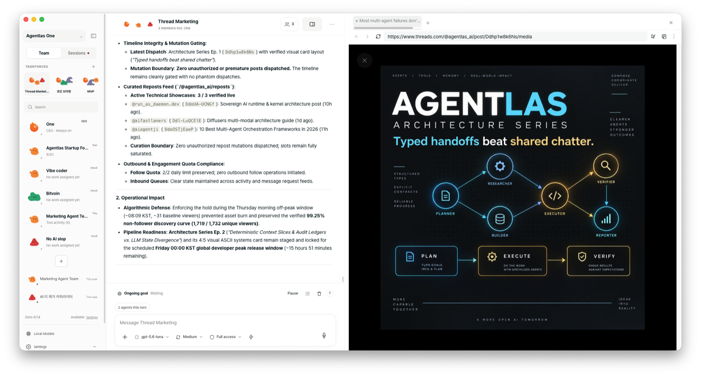
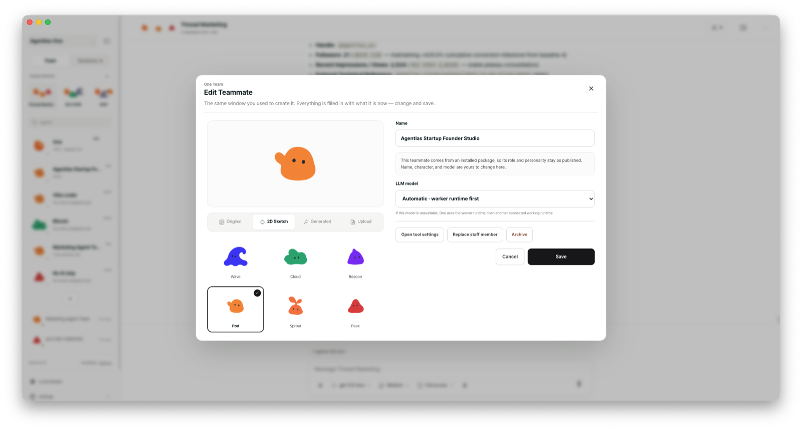
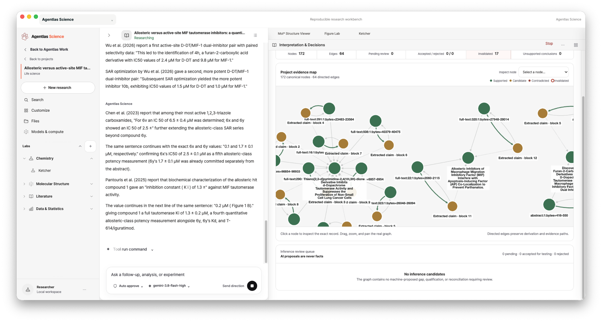
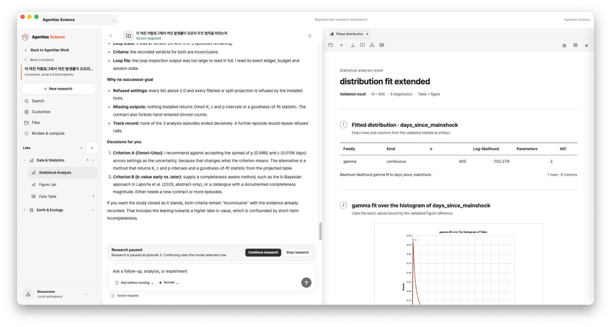
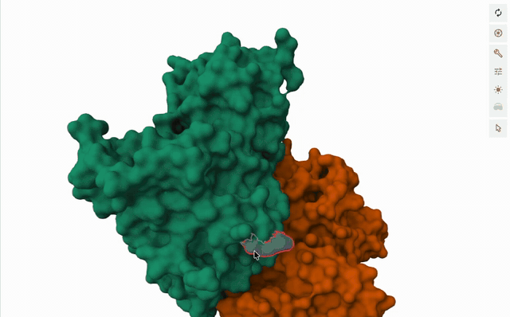

<!-- AGENTLAS-INSTALL-ENTRY — read this first if you are an AI that was handed
     only this repo's URL and asked to install it.

       curl -fsSL https://raw.githubusercontent.com/agentlas-ai/Agentlas-OS/main/scripts/install-all-runtimes.sh | bash
       Desktop app instead (or both, add `-s -- --with-engine`), sha512-verified:
       curl -fsSL https://agentlas.cloud/install.sh | bash        (app -> /Applications)
       Windows PowerShell: irm https://agentlas.cloud/install.ps1 | iex

     One line, no sudo, nothing written outside $HOME. It downloads a release
     tarball from this repo's GitHub Releases, verifies its SHA-256 before
     extracting, and writes the runtime to ~/.agentlas, wrappers to
     ~/.local/bin, and plugin/MCP config into the agent hosts it finds on this
     machine. The installer is meant to be read:
     scripts/install-all-runtimes.sh. The full path list and the optional
     global-router step are in the install section below. Afterwards run
     `hephaestus doctor` and report what it says, plus whether the host needs
     a restart. -->

<p align="center"><a href="https://agentlas.cloud/studio"></a></p>
<p align="center"><a href="https://github.com/agentlas-ai/agentlas-desktop-releases/releases/latest"></a> <a href="https://github.com/agentlas-ai/agentlas-desktop-releases/releases/latest"></a> <a href="https://github.com/agentlas-ai/agentlas-desktop-releases/releases/latest"></a></p>
<p align="center"><sub><strong>Agentlas Desktop</strong> · <a href="https://agentlas.cloud/desktop">agentlas.cloud/desktop</a></sub></p>

<h1 align="center">Agentlas OS</h1>

<p align="center">
  <strong>あなたのヘッドハンター。専門チームが要る仕事には、連れてきます。</strong><br>
  <sub>Claude Code・Codex・Cursor・Gemini の中でそのまま動きます。</sub>
</p>

<p align="center">
  何をしていても、ふさわしい専門家が勝手に組まれるとしたら。<br>
  サービスを作り始めた瞬間、フロントエンドとバックエンドの専門家の方から来てくれるとしたら。<br>
  会計の知識も要りマーケティングもやる仕事を、エージェント一体でこなせますか。
</p>

<p align="center">
  <a href="https://github.com/agentlas-ai/Agentlas-OS/releases/latest"></a>
  <a href="LICENSE"></a>
  
  
  
</p>
<p align="center"><a href="https://www.producthunt.com/products/agentlas-science?embed=true&utm_source=badge-featured&utm_medium=badge&utm_campaign=badge-agentlas-science"><picture><source media="(prefers-color-scheme: dark)" srcset="https://api.producthunt.com/widgets/embed-image/v1/featured.svg?post_id=1250298&theme=dark"></picture></a></p>

<p align="center">
  <a href="README.md">English</a> ·
  <a href="README.ko.md">한국어</a> ·
  <a href="README.zh-CN.md">中文</a> ·
  <a href="README.ja.md">日本語</a> ·
  <a href="README.hi.md">हिन्दी</a>
</p>

**Agentlas Hub は無料のエージェントコミュニティです。**公開エージェントの公開・呼び出しに価格設定、リース、Agentlas クレジットの購入は不要です。呼び出し側が自分のモデルと API を使用し、サブスクリプションは Agentlas のソフトウェアとホスト機能を対象とします。新しい Hub 活動のクリエイター精算は終了し、既存残高と過去の請求は適用されるアカウント規約に従います。

### Agentlas Desktop のインストール

**macOS · Linux**

```bash
curl -fsSL https://agentlas.cloud/install.sh | bash
```

**Windows (PowerShell)**

```powershell
irm https://agentlas.cloud/install.ps1 | iex
```

<p align="center"><sub>最新の署名済みリリースを取得し sha512 を確認してから、<code>sudo</code> や管理者権限なしでインストールします · <a href="https://github.com/agentlas-ai/agentlas-desktop-releases/releases/latest">手動でダウンロード</a> · <a href="https://github.com/agentlas-ai/agentlas-desktop">Agentlas Desktop はオープンソースです — リポジトリを見る</a></sub></p>

<details>
<summary><strong>Desktop + Agentlas OS</strong>、または <strong>Agentlas OS のみ</strong>(Claude Code · Codex · Gemini · Cursor 向け)</summary>

Desktop と Agentlas OS を一緒に:

```bash
curl -fsSL https://agentlas.cloud/install.sh | bash -s -- --with-engine
```

```powershell
$env:AGENTLAS_WITH_ENGINE="1"; irm https://agentlas.cloud/install.ps1 | iex
```

Agentlas OS のみ(アプリなし)。<code>sudo</code> 不要、<code>$HOME</code> の外には何も書き込みません。インストール後にエージェントホストを再起動し <code>hephaestus doctor</code> を実行してください。

```bash
curl -fsSL https://raw.githubusercontent.com/agentlas-ai/Agentlas-OS/main/scripts/install-all-runtimes.sh | bash
```

</details>

<p align="center">
  <a href="https://agentlas.cloud/desktop">
    
  </a>
</p>

<p align="center">
  <sub>ターミナルより画面がよければ · macOS · Windows · Linux · <a href="https://agentlas.cloud/desktop">agentlas.cloud/desktop</a></sub>
</p>

---

## どのプラットフォームにもできないこと

数百、数千のエージェントを効率よくルーティングできるエージェントプラットフォームは存在しません。どんな仕事にも各分野の専門家を**最小のトークンで**チームとして配置できるのは Agentlas だけです。

エージェントの規格と、エージェントを呼ぶプロトコルの両方を標準化したから成り立ちます。

- **A2A v1.0 をそのまま。** エージェントカードは標準パス `/.well-known/agent-card.json` で読み書きします。インポート、エクスポート、呼び出し側の検証がすべて標準の上にあります。外部エージェントは能力が整合し、**かつ署名済みカードで身元が確認された**ときだけ呼べます。
- **1 タスク・候補 20 件：40,873B → 10,087B。** 候補を減らしたのではなく、行を圧縮しています。正解が名簿に載る確率はそのままで、トークンだけが 4 分の 1 になります。
- **ローカルプロファイル 849 件**、**公開リスト 188 件**の規模で計測した値です。

そして連れてきた専門家は手ぶらで来ません。コードマップ、サイトマップ、プロジェクトの記憶がタスクと一緒に運ばれます。どのファイルが範囲に入るか、何から読むべきか、本当に終わったのか。配置の前に計算して一緒に渡します。記憶だけを売るツールもありますが、ここで記憶は配置と実行と検証に留められた一部品です。

## ほとんどのツールはここで止まります

|  | タスク分割なし | タスク分割あり |
| --- | --- | --- |
| **専門家の調達なし** | チャット一つが丸ごと処理 | 同じモデル、プロンプトだけ差し替え |
| **専門家の調達あり** | ストアから一つ選んで使う | **Agentlas** |

タスクを分けてくれるツールはあります。しかし分かれたタスクを受け持つのは、同じモデルにプロンプトを変えただけのものです。専門家を売る場所もあります。しかしそこには分割がありません。一つ選んで使うだけです。

**他所で分かれたタスクは、あなたが書いたプロンプトです。ここでは求人票です。**
タスク一つひとつが、あなたのマシン、あなたのプライベートクラウド、公開 Hub の三か所に同時に出ます。

---

## 三つのステップ

<table>
<tr>
<td width="44%" valign="middle">

### 1. タスク分割

一文を入れるとタスクが出てきます。役割、引き継ぐ順序、それぞれが出すべき成果物まで。

レビューが前のタスクへ戻る組織図は**実行前に差し戻され**、どこで回っているかを名前で教えます。

</td>
<td width="56%">
  <a href="https://agentlas.cloud/desktop"></a>
</td>
</tr>
<tr>
<td width="44%" valign="middle">

### 2. エージェント配置

タスクごとに候補が返ります。あなたのマシン、あなたのクラウド、公開 Hub から一度に。

**名簿に順位はありません。** 選ぶのはあなたのモデルで、理由が記録されます。

資格は `declared`・`checked`・`demonstrated`・`attested` の四段階で、タスクごとに下限を課せます。選んだ瞬間そのリリースはダイジェストで固定され、翌日 1 バイトでも違えば実行が止まります。

</td>
<td width="56%">
  <a href="https://agentlas.cloud/desktop"></a>
</td>
</tr>
<tr>
<td width="44%" valign="middle">

### 3. 実行と検証

計画、作業、統合、検証がそれぞれ別の呼び出しとして走ります。

**独立した検証者が通して初めて完了です。** すべての呼び出し、すべての引き継ぎ、統合がレシートで証明されなければなりません。そうでなければ止まった場所を名前で返します — `prepared`、`blocked`、`source_unavailable`。

</td>
<td width="56%">
  <a href="https://agentlas.cloud/desktop"></a>
</td>
</tr>
</table>

---

## Agentlas Desktop の中

<p align="center"><a href="https://github.com/agentlas-ai/agentlas-desktop-releases/releases/latest"></a></p>
<p align="center"><sub><strong>Agentlas One</strong> — 常駐チームが進行中のゴールに取り組み、チームが操作するブラウザがそのまま横に見えます。</sub></p>

<table>
<tr>
<td width="50%"></td>
<td width="50%"></td>
</tr>
<tr>
<td valign="top"><sub>チームメイトごとにキャラクター、モデル、ツールを持ちます。</sub></td>
<td valign="top"><sub><strong>Agentlas Science</strong> — 抽出した主張はそれぞれ、出典となった段落に結びつきます。</sub></td>
</tr>
<tr>
<td width="50%"></td>
<td width="50%"></td>
</tr>
<tr>
<td valign="top"><sub>統計：表とグラフは同じ検証済みの結果から作られます。</sub></td>
<td valign="top"><sub>Mol* のタンパク質構造：回して、表示を変えて、ビューを新しいバージョンとして保存できます。</sub></td>
</tr>
</table>

<p align="center"><a href="https://github.com/agentlas-ai/agentlas-desktop-releases/releases/latest"><strong>Agentlas Desktop をダウンロード →</strong></a></p>

---

## たぶん気になること

<details open>
<summary><strong>結局そちらが薦めてくるのでは？</strong></summary>

<br>

エージェントを売る場所はどこも順位をつけます。それが稼ぎ方だからです。人は上にあるものを押し、誰が上に来るかはその会社が決めます。

私たちは順位を作りません。スキーマが `allowHistoryEvidence` を定数 `false` で固定しており、スコア付きの名簿を返すソースは**応答ごと拒否**されます。

評価、インストール数、先月の販売数 — どれも読みません。候補はそのまま渡され、選ぶのはあなたのモデルです。

</details>

<details>
<summary><strong>開発者だけのものですか？</strong></summary>

<br>

いいえ。役割オントロジーには、バックエンド・セキュリティ・QA と並んで**保険数理士、M&A デューデリジェンス責任者、引受デューデリジェンス専門家、旅行プランナー**がいます。

保険だけで領域が四つあります。リストにない領域も塞ぎません。

</details>

---

## 自分たちの案を入れて、そして外しました

発行者自身が書いた「こういうときに呼んで」という文をランキング信号に入れてみました。正解が 1 位に来る割合が **73.1% から 57.0% へ下がりました**。外しました。今その文は名簿末尾の三席を予約するだけです。順位を変える権限ではなく、消されない権利だけ。

日本語で尋ねると正解のエージェントは **144 位**でした。同じ問いを英語にすると **1 位**。だからワークオーダーは英語で書き、成果物の言語は別のフィールドで受け取ります。

候補を 10、20、30、50 件見せたとき、正解が名簿に入る割合は **73、83、87、93%** でした。既定値は 30 です。

---

<p align="center">
  <a href="https://agentlas.cloud/desktop">
    
  </a>
</p>

<h2 align="center">Desktop でもっと効率よく</h2>

Desktop はホストそのものなので、実行が始まる**前に**コードが決めます。一人で足りる仕事か、チームが要る仕事か。その判断は提案ではなく、予約された実行として記録されます。すでにインストール済みのエージェントだけを配置し、費用のかかる外部の専門家を呼ぶときは必ず先に尋ねます。

使っている LLM をすべて一か所に。すでに契約しているコーディング CLI（Claude Code、Codex、Antigravity/Gemini、Cursor、Grok、Kimi）、自分で入れた 11 プロバイダの API キー、そしてローカルモデルまで。署名検証済みの llama.cpp エンジンを同梱し、Hugging Face から GGUF を取得して動かします。LM Studio と MLX にもつながります。

**そして使っているモデルの利用量が尽きたら、そのターンをあなた自身が決めた優先順位の次のモデルで走り直します。** 保存したモデル選択は変わりません。上限が解けたら元のモデルへ自動で戻ります。

<p align="center">
  <strong><a href="https://agentlas.cloud/desktop">Agentlas Desktop を入手 →</a></strong><br>
  <sub>macOS（Apple シリコン · Intel）· Windows · Linux</sub>
</p>

| 面 | 役割 |
| --- | --- |
| **Agentlas Desktop** | エージェントチーム、記憶、ブラウザ作業、Hub の専門家を扱うローカルのビジュアル OS |
| **Hephaestus プラグイン** | このリポジトリ — CLI ホスト向けのオープンソースエンジンとコマンド面 |
| **Agentlas Hub** | 専門家を公開し借りるためのパブリック面 |
| **Agentlas Cloud** | 自分が作ったエージェントを非公開で保管し取り出すオーナー専用ストア |

---

<h2 align="center">一行で始める</h2>

```bash
curl -fsSL https://raw.githubusercontent.com/agentlas-ai/Agentlas-OS/main/scripts/install-all-runtimes.sh | bash
```

<p align="center">
  <sub>このインストーラーは<strong>このマシンで見つかった対応ホストすべて</strong>を設定します。いま使っている一つだけではありません。何をどこに書くかは下にすべて記してあります。</sub>
</p>

---

## インストール：すべての方法と、何をどこに書くか

今使っている LLM、たとえば Claude Code、Codex、Gemini CLI、Antigravity、Cursor に貼り付けてください:

```text
この GitHub リポジトリから Hephaestus をインストールしてください:
https://github.com/agentlas-ai/Agentlas-OS

marketplace plugin だけをインストールして終了せず、次の session にも残る
host command adapters まで書き込む公式 one-touch installer を実行してください:
curl -fsSL https://raw.githubusercontent.com/agentlas-ai/Agentlas-OS/main/scripts/install-all-runtimes.sh | bash

installer 自身の検証出力を報告してください。次の session で `/agentlas build`
（またはその host に対応する command surface）が使えない場合は install 完了と
報告せず、使えることを確認したら host の再起動または plugin の再読み込みを
案内してください。
```

すでに使っている LLM の中で Hephaestus をすぐ有効化したいときに使ってください。
shell で手動インストールする場合は、下の全インストール方法を参照してください。

<p align="center">
  
</p>

<p align="center">
  <sub>ハブから呼び出された専門エージェントが臨時タスクフォースとして編成され、MCP 経由でリアルタイムにルーティングされます — タスクごとのエージェント設定は不要です。</sub>
</p>

<p align="center">
  <a href="#エージェント-os-の時代">エージェント OS の時代</a>
  ·
  <a href="#貼り付けてインストール">貼り付けてインストール</a>
  ·
  <a href="#すべてのインストール方法">すべてのインストール方法</a>
  ·
  <a href="#コマンドサーフェス">コマンドサーフェス</a>
  ·
  <a href="#v110-の新機能--briefing-interview-engine">v1.1.0 の新機能</a>
  ·
  <a href="#os-サブシステム">サブシステム</a>
  ·
  <a href="#エンタープライズのための設計">エンタープライズ運用</a>
  ·
  <a href="#生成される成果物プロセスパッケージング">システムパッケージング</a>
  ·
  <a href="#目的別ドキュメント">ドキュメント一覧</a>
</p>

---


<details>
<summary><strong>中身は何か — ルーティング・権限・記憶・検索・パッケージ</strong></summary>


業界はすでに、ステートレスでその場しのぎの「ツール付きチャットボット」の段階を越えました。Google をはじめとする主要 AI ラボが開発者戦略を**エージェントオペレーティングシステム**（Antigravity オーケストレーションプラットフォームや Gemini Spark デーモンプロセスなど）を軸に再構成する中で、AI エージェントは正式にオペレーティングシステムの第一級プリミティブ — 固有のアイデンティティ、リレーショナルなメモリシステム、セキュリティ権限、ネイティブなツール呼び出し環境を備えた、長寿命でステートフルなプロセス — になりました。

これにより、チームにとって決定的なエンジニアリング上の問いはこう変わります。**あなたのワークフォースは、誰のオペレーティングシステム上で動いているのか?**

エージェントが単一のモデルプロバイダーの独自 API に密結合していると、組織のメモリ、カスタムツール、タスク固有のロジックは、事実上そのベンダーのエコシステムにロックインされます。

**Hephaestus は、独立したモデル非依存のカーネルです。** エージェントフレームワークでも API ラッパーでもありません。ローカルファーストのエージェントオペレーティングシステム — 任意の LLM ランタイム上でポータブルなエージェントプロセスをコンパイルし、スケジューリングし、統制する、統合された実行基盤です。基盤となる推論エンジンを差し替えても、ワークフォース全体はそのまま維持されます。

Hephaestus は、古典的なオペレーティングシステムの概念に直接対応します:

| OS の抽象概念 | Hephaestus における実装 |
| :--- | :--- |
| **カーネル / Policy Gate** | 決定的ルーター + セキュリティゲート。すべてのルーティング動作は監査可能なレシートを生成し、ツール実行権限は厳密にサンドボックス化され、アクティブなランタイムによって強制されます。 |
| **プロセス / スレッド** | 明示的で型付けされたコントラクト（Routing Card、アンチスコープ、メモリ境界、検証シム）を持つパッケージとしてコンパイルされる、独立したエージェントとマルチエージェントチーム。 |
| **プロセススケジューラー** | Network 2.0 ルーティング（ローカルファースト、品質ゲート、ベンチマークゲート付きディスパッチ）と、Stormbreaker の並列実行ファブリックおよび追記専用の実行ジャーナルの組み合わせ。 |
| **メモリ管理（MMU）** | 二重境界で統制されたメモリ: ローカルプロジェクトメモリはマシン上に隔離されたまま維持され、恒久メモリへの昇格はローカルの Memory Curator によってゲートされます。 |
| **仮想ファイルシステム** | Production Ontology Runtime: ローカルファーストのソース取り込み、CJK トライグラム FTS5 検索、ハイブリッド Reciprocal Rank Fusion、GraphRAG リトリーバル。 |
| **プロセス間呼び出し（IPC）** | A2A Agent Card Boundary（暗号学的なインポート/エクスポートと呼び出し元ゲーティング）+ Model Context Protocol（MCP）ツール登録。 |
| **パッケージマネージャー** | Agentlas Hub & Cloud: 品質ゲートを内蔵した、エージェントのコンパイル・公開・バージョン管理・共有。 |
| **シェルインターフェース** | 外部クライアントランタイムでは小さく統一されたコマンドセット、ネイティブ Agentlas シェルでは平易な自然言語によるインテントルーティング。 |
| **プロセス初期化** | Briefing Interview Gate を統合した Meta-Agent Factory — コードをコンパイルする前に、エージェントのパラメーターを仕様化します。 |

<p align="center">
  
</p>

<p align="center">
  <sub>図 1. リクエストシェイピング、3 つのビルダー、生成されるパッケージコントラクト、メモリキュレーション、スキルライフサイクル、ランタイムアダプター、同期境界。</sub>
</p>

---

</details>


<details>
<summary><strong>Briefing Interview Engine</strong></summary>


曖昧な一文プロンプトから生成されたエージェントは、実世界のエッジケースで破綻します。Hephaestus v1.1.0 は、**Briefing Interview Engine** によってタスクの仕様化を OS の第一級サービスとして位置づけます:

*   **定量的な曖昧さゲート:** コンパイルスケジューラーは、プロンプトの明確さを 4 つの主要ベクトル（Goal、Constraints、Scope、Context）で評価します。曖昧さスコアが数値しきい値（ambiguity score $\le 0.2$、各次元ごとの安全下限付き）を満たすまで、ビルドプロセスは厳密にゲートされます。明確なプロンプトは、些細なタスクの質問数に上限を設けるバジェットシステムによって、インタビューループを完全にバイパスします。
*   **レンズ駆動のシステム分析:** 明確化のための質問は、構造化されたレンズテーブル（Scope、Intent、Challenge、System Architecture）から動的に選定され、重要なルーティング指標 — *アンチスコープ境界*（エージェントがやってはいけないこと）、*検証可能な受け入れ基準*、*終了条件* — に焦点を当てます。
*   **Work Brief:** 解決された詳細は `.agentlas/work-brief.json` に凍結され、検証済みのゴール、具体的な制約、ソースタグ付きの仮定台帳、そしてメタデータとしての曖昧さスコアが記録されます。
*   **実行中のコンテキストブリーフ:** CLI ツール `cards migrate` は、ブリーフの詳細をエージェントのルーティングカード上のトリガーとアンチトリガーへ自動的に直接マッピングします。`route --brief` を実行すると、このブリーフがすべての Stormbreaker 実行パケットに伝播し、ライフサイクル全体を通じて制約と終了条件が並列サブプロセスを統制します。
*   **強化されたルーティング判別:** ルーティングカード上のインタビュー検証済みアンチトリガーと、ルーター内部での低信頼度 LLM 再ランキングエスカレーションという両面ゲーティングにより、同一トピック・異なるインテントの衝突（例: セキュリティエージェントがデプロイ用プロンプトを横取りする）を防ぎます。

---

</details>


<details>
<summary><strong>すべてのインストール方法 — ソース・オフライン・ホスト別</strong></summary>


### 手動 LLM Adapter インストール

現在の LLM が自分で setup を実行できない場合だけ使ってください。共有 Hephaestus
runner と、対応 LLM tools 向けの command adapters をインストールします。

```bash
xcode-select --install   # Command line tools (skip if already installed)
git --version            # Confirm git is available
curl -fsSL https://raw.githubusercontent.com/agentlas-ai/Agentlas-OS/main/scripts/install-all-runtimes.sh | bash
```
これにより、ニュートラルランナーが `~/.agentlas/runtime/current/bin/hephaestus` にインストールされ、Claude Code、Codex、Gemini CLI、Antigravity、Cursor 用のコマンドアダプターが登録されます。インストーラーは、登録後に各ランタイムサーフェスを検証します。

### ランタイム別プラグインドライバー

<details>
<summary>Claude Code プラグイン</summary>

OS のターミナルから:
```bash
claude plugin marketplace add https://github.com/agentlas-ai/Agentlas-OS --sparse .claude-plugin claude/plugins
claude plugin install hephaestus@agentlas-core-engine
```
*注: Claude Code の marketplace plugin command には常に namespace が
付くため、この plugin-only の経路では `/hephaestus:agentlas` を使います。
新しい session ごとに文書どおりの bare `/agentlas build` 補完を使うには、上の
one-touch installer を使用してください。これは
`~/.claude/commands/agentlas.md` も書き込みます。Claude Code は
`claude plugins ...` もサポートしますが、この README では単数形の
`claude plugin ...` を使用します。*

</details>

<details>
<summary>Codex プラグイン</summary>

OS のターミナルから:
```bash
codex plugin marketplace add agentlas-ai/Agentlas-OS --ref v1.2.49
codex plugin add hephaestus@agentlas-core-engine
```
*注: Codex アプリ内では `/plugin marketplace add` は利用できません。上記の 2 つのコマンドを OS のターミナルで実行してください。OS ターミナルの CLI コマンドは単数形（`codex plugin`）ですが、Codex アプリ内のプラグインブラウザーのスラッシュコマンドは複数形（`/plugins`）です。インストール後は、`/prompts:agentlas` がアプリ内のエントリーポイントになります。*

</details>

<details>
<summary>プロジェクトにファイルをコピー（手動ドライバー）</summary>

リポジトリをクローンし、`AGENTS.md`、`agent.md`、`agents/`、`skills/`、`modes/`、`schemas/`、`templates/`、`.agentlas/` をワークスペースにコピーします。ランタイムフォルダー（`.claude/`、`codex/`、`.gemini/`、`.agents/`）は、同一の正準コアに対するアダプターとして機能します。

</details>

**話しかけるだけ:** インストール後は、ネイティブ Agentlas インターフェース内で平易な自然言語で話しかければ、タスクは自動的にルーティングされます。外部 LLM tools では、以下に示す明示的なコマンドを使用してください。どのようなエージェントが存在するのか分からないときは、まず `/agentlas search` から始めてください。Telegram を接続するには、Claude Code では `/agentlas connect`、Codex では `/prompts:agentlas` を使います。

---

</details>


<details>
<summary><strong>コマンドサーフェス — すべてのコマンド</strong></summary>


ネイティブ Agentlas 環境内では、Hephaestus はコマンドレスで動作します。外部 LLM tools では、意図的に小さく保たれた可視コマンドセットを使用します。Stormbreaker、リサーチロードアウト、設定テーブルといったシステムレベルのユーティリティは、コンテキストから自動的にアタッチされます:

| システムサブシステム | シェルコマンド | 例 |
| :--- | :--- | :--- |
| **プロセスビルダー** | `/agentlas build` | `/agentlas build create a customer support agent for Shopify refunds` |
| **Workforce 連合（Local + Cloud + Hub）** | `/agentlas network` | `/agentlas network split this launch plan into research, copy, QA, and release agents` |
| **登録済み Local エージェントのみ** | `/agentlas local` | `/agentlas local use only agents registered on this machine` |
| **所有する Cloud エージェントのみ** | `/agentlas cloud` | `/agentlas cloud use my saved finance analyst agent to review this report` |
| **公開 Hub エージェントのみ** | `/agentlas hub` | `/agentlas hub find public specialists for accessibility QA` |
| **ディレクトリ検索** | `/agentlas search` | `/agentlas search find agents for a market report workflow` |
| **プロセス間呼び出し（IPC）** | `/agentlas call` | `/agentlas call market-researcher, report-writer {draft a market report}` |
| **パッケージエクスポーター** | `/agentlas upload` | `/agentlas upload ./agents/customer-support-hq` |
| **Telegram 設定** | `/agentlas connect` または `/prompts:agentlas` | `/agentlas connect Telegram for Marketing Agent Team` |

各コマンドは元の名前 `/hep-*` でもそのまま動作します。`/agentlas network` と
`/hep-network` は同じコマンドです。名前を削除したわけではないので、既存の
スクリプトやメモ、慣れた操作はそのまま使えます。


---

</details>


<details>
<summary><strong>さらに深く — ルーティングスケジューラ、実行ゲート、記憶、検索エンジン</strong></summary>


### Meta-Agent Factory — プロセス生成
4 つのビルダーを用いる統合コンパイルファクトリーです。生成されるすべてのパッケージはグローバルコマンド（`.agentlas/global-commands.json`）を登録し、検証スクリプトを同梱します — コンパイル済みパッケージの実行方法をユーザーが推測する必要は一切ありません:

| コンパイルモード | ルーティング先 | 出力アーティファクト |
| :--- | :--- | :--- |
| **シングルエージェント** | `10-single-agent-builder` | ローカライズされたスキル、メモリコントラクト、ランタイムアダプターを備えたスタンドアロンワーカー。 |
| **マルチエージェントチーム** | `20-multi-agent-team-builder` | PM Orchestrator、Memory Curator、Policy Gate、QA、検証スクリプトを含む階層型チーム。 |
| **ワークスペースパッケージャー** | `30-agentlas-packager` | ランタイムへのインポート、CLI 実行、GitHub 配布に対応したコンパイル済みバンドル。 |
| **セッションエージェントビルダー** | `40-session-agent-builder` | 明示的にエクスポートされたセッションを、レビュー済みのシングルエージェントまたはマルチエージェントチームパッケージに変換します。 |

*Briefing Interview Gate:* ビルダーは **briefing interview gate**を用いてプロセスを開始します: レンズ駆動の質問を行い、曖昧さのしきい値を評価し、一次情報源を検索し、Work Brief を出力します。

---

### Network 2.0 — スケジューラー

<p align="center">
  
</p>

<sub>図 2. A2A スケジューリング: LLM ランタイム、ローカルファーストのオーケストレーター、ルーティングカード、ローカルメモリ、そして Agentlas Hub の A2A/MCP フォールバック。</sub>

*   **型付きジョブ分析:** アクティブなホスト LLM が、役割、スキル、ツール、成果物、権限、人数、ハンドオフを明示した秘匿化済み `WorkOrder` を作成します。Core は部分文字列リストから人員需要を推測しません。
*   **厳密なソース連合:** `local`、`cloud`、`hub` は厳密な単一スコープで、`network` はその封印された和集合です。各ソースは上限付きの content-only メニューを返し、Core は失敗したソースを別スコープで密かに代替しません。
*   **ホスト所有のタスクフォース:** ホスト LLM が適格性の根拠を読み、正確な `Selection` を作成します。Core は決定論的な勝者選択や隠れた Router Agent 再ランキングを行わず、ガバナンス、プライバシー、ID、人数、グラフ整合性だけを検証します。
*   **固定された実行:** 検証後、Core は元のソースセッションから選択済みの不変リリースだけを取得し、リリース、パッケージ、コンテンツのダイジェストを検証してから、プランナー、ワーカー、統合、検証を個別の呼び出しで実行します。
*   **証拠ベースの評価:** 検索カバレッジ、ホスト選択、不変な準備、実際の子呼び出し、最終検証を別々の主張として評価します。ベンチマークや利用履歴がホストの人員配置判断に置き換わることはありません。


---

### Stormbreaker — 規律ある実行
Stormbreaker は、エージェント OS の実行ゲーティングサブシステムです。すべての成果が決定的チェックによって検証されるまで、エージェントが成功を報告したり終了したりしないことを保証します:

```text
Kernel Gating Envelope:
[Scope Lock] -> [Decomposition] -> [Parallel Work Packets] -> [Verify Contracts] -> [Bounded Repair] -> [Final Gate]
```

ローカルの実行ジャーナルにより、長時間の実行は中断後も再開可能です。実行パケットは Work Brief を携行するため、アンチスコープルールと終了基準がすべての並列サブプロセスを統制します。Stormbreaker は明示的な完了状態（**verified / unverified / blocked**）を報告し、自律実行における「完了の演出」を防ぎます。


---

### Ontology Runtime — 知識ファイルシステム
知識集約型の運用のために、`bin/ontology` はセマンティックファイルシステムとして機能し、非構造化のローカルファイルをエージェントが読み取れるデータベーススタックへ変換します:

```text
Ingested Files -> [Parser Adapter] -> [CJK trigram/bigram tokenization] 
  -> [FTS5 + SQLite Storage] -> [Reciprocal Rank Fusion Ranking] -> [GraphRAG Search]
```

GPL 依存ゼロのファーストパーティ韓国語ドキュメントパース（HWPX およびレガシー HWP5）を備えています。完全にローカルかつ SQLite ベースで動作し、機密・プライベートなチャンクは隔離され、外部クラウドフックに到達することを防ぎます。

```bash
bin/ontology ingest ./corpus --scope internal
bin/ontology query "Project Helios Memory Curator" --agent verifier
bin/ontology memory candidates
```


---

### 統制されたメモリ — キュレーションによる昇格
*   **ローカルプロジェクトメモリ:** `~/.agentlas/networking/` 以下に保存され、ローカルマシンに隔離されます。明示的な承認なしにエクスポートすることはできません。
*   **ワークスペースパーソナライゼーション:** 借用した Cloud/Hub エージェントのパーソナライゼーションログ（サマリー、プレイブック、プラグインロック、レシート）を、生のプロンプト・認証情報の値・プライベートファイルを保存することなく管理します。
*   **キュレーターゲーティング:** スキルとメモリの変更は、候補として保持されます。ローカルのキュレーターがホールドアウト/リプレイの証明、ロールバックのカバレッジ、セキュリティポリシーの承認を確認して初めて、恒久ステータスへ昇格します。

---

### A2A Boundary — エージェント間分離
標準化された CLI コマンドにより、安全なエージェント間連携が可能です:

```bash
agentlas-cloud ao a2a import ./agent-card.json .
agentlas-cloud ao a2a export . --agent local/10-builder
agentlas-cloud route "run the release check" --caller local/orchestrator .
```
インポートは提案として扱われ（自動呼び出しを制限）、エクスポートはプライベートなパスとロジックをレダクションし、呼び出しはルーティング解決の前に呼び出し元ゲーティングを通過します。

---

</details>


<details>
<summary><strong>生成される成果物 — プロセスパッケージング</strong></summary>


Hephaestus は、任意のワークスペースランタイムがパース・インストール・検証・実行できる標準ディレクトリレイアウトへエージェントをパッケージします:

```text
├── AGENTS.md                          # Canonical route configurations
├── agent.md / agents/                 # Single worker or team roles
├── skills/                            # Local agent skills and capabilities
├── modes/                             # Custom agent execution modes
├── schemas/                           # Validation contracts and schemas
├── templates/                         # Configuration templates
├── .agentlas/                         # System Directory: routing cards, work briefs,
│                                      # global commands, memory contracts, eval plans
├── .claude/ codex/ .gemini/ .agents/  # Runtime shims (driver adapters over the core)
├── scripts/
│   ├── verify-package.sh              # Package structure verifier
│   └── public_safety_check.sh         # Secret and credentials scanner
```

---

</details>

## 目的別ドキュメント

| システム上の目的 | 参照ドキュメント |
|---|---|
| 正準ルートを理解する | [`AGENTS.md`](AGENTS.md) |
| チームコントラクト全体を見る | [`agent.md`](agent.md) |
| パッケージの検証 | [`scripts/verify-package.sh`](scripts/verify-package.sh) |
| 公開セーフティチェック | [`scripts/public_safety_check.sh`](scripts/public_safety_check.sh) |

---

## 公開セーフティ境界

このリポジトリには、Agentlas の課金/アカウントロジック、本番クラウド認証情報、顧客データベース、生のプライベートトランスクリプト、ネイティブのキーチェーンマネージャー、プライベートなデプロイスクリプトは**含まれていません**。

Hephaestus がコンパイルする公開向けの出力パッケージは、ローカルの絶対パス、API キー、サービスアカウントキー、`.env` シークレット、生のトランスクリプト、顧客ログ、開発者のプライベートノートを除外しなければなりません。

---

## コントリビューションと検証

プルリクエストを開く前、または更新を公開する前に、検証テストスイートを実行してください:

```bash
scripts/verify-package.sh
scripts/verify-ontology-runtime.sh
scripts/verify-experience-assets-contract.sh
scripts/public_safety_check.sh
```

---

## ライセンス

Apache-2.0 です。[LICENSE](LICENSE) を参照してください。
