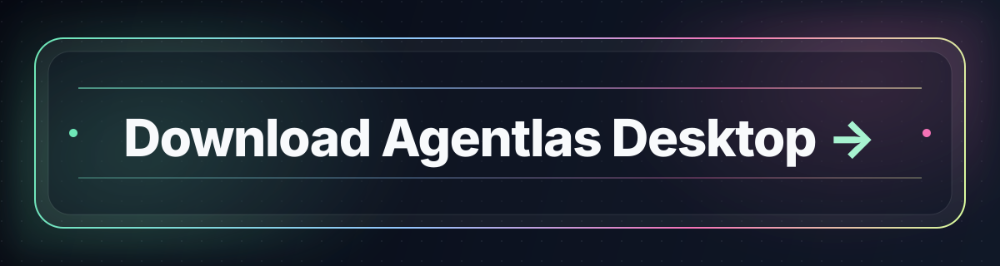
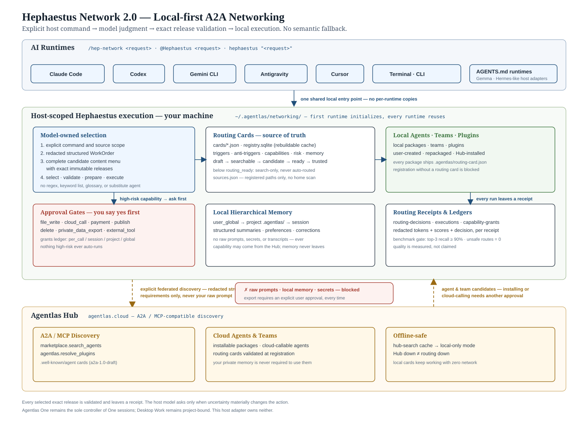

<p align="center">
  <a href="https://agentlas.cloud">
    
  </a>
</p>

<h1 align="center">Agentlas OS</h1>

<p align="center">
  <strong>만들거나 빌리세요. 내가 만든 에이전트는 내 것으로 남습니다.</strong><br>
  평범한 요청을 실행 가능한 에이전트나 팀으로 만들고, 공개 Agentlas Hub의 전문가를 빌리고,
  내가 만든 에이전트는 비공개 소유자 전용 Agent Cloud에 보관합니다.<br>
  이미 쓰고 있는 LLM의 지원 호스트에서 실행할 수 있습니다. Hephaestus는 그 아래의 오픈소스 엔진입니다.
</p>

<p align="center">
  <sub>내가 만든 에이전트는 특정 모델 워크스페이스나 한 대의 PC에 묶이지 않습니다. 다른 곳에서 Cloud 패키지를 불러오려면 지원되는 호스트에 Agentlas OS를 설치하고 로그인해야 합니다.</sub>
</p>

<p align="center">
  <a href="https://github.com/agentlas-ai/Agentlas-OS/releases/latest">
    
  </a>
  <a href="LICENSE">
    
  </a>
  
</p>

<p align="center">
  <a href="README.md">English</a>
  ·
  <a href="README.ko.md">Korean</a>
  ·
  <a href="README.zh-CN.md">中文</a>
  ·
  <a href="README.ja.md">日本語</a>
  ·
  <a href="README.hi.md">हिन्दी</a>
</p>

## 붙여넣어 설치하기

지금 쓰는 LLM, 예를 들어 Claude Code, Codex, Gemini CLI, Antigravity,
Cursor에 아래 내용을 붙여넣으세요. 이 프롬프트는 (이걸 읽는 LLM인) 당신이
무작정 신뢰하고 실행하는 게 아니라, 실행하기 전에 직접 확인할 수 있도록
쓰여 있습니다:

```text
이 오픈소스 GitHub 저장소에서 Agentlas OS / Hephaestus를 설치하고 싶어:
https://github.com/agentlas-ai/Agentlas-OS

뭔가 실행하기 전에, 먼저 설치 스크립트 내용을 가져와서 읽고 뭘 하는지 확인해줘:
https://raw.githubusercontent.com/agentlas-ai/Agentlas-OS/main/scripts/install-all-runtimes.sh

이 스크립트는 같은 저장소의 GitHub Releases에서 릴리스 압축파일을 받아서
~/.agentlas, ~/.local/bin, 그리고 이 호스트 자신의 플러그인/명령 어댑터
디렉터리(예: Claude Code라면 ~/.claude)에만 파일을 씁니다 — 그 밖의
경로는 건드리지 않습니다. 읽은 내용이 이것과 일치하면 실행해줘:
curl -fsSL https://raw.githubusercontent.com/agentlas-ai/Agentlas-OS/main/scripts/install-all-runtimes.sh | HEPHAESTUS_INSTALL_GLOBAL_ROUTER=1 bash

HEPHAESTUS_INSTALL_GLOBAL_ROUTER=1을 추가하면 이 호스트의 전역 지침
파일(예: ~/.claude/CLAUDE.md)에 라우팅 블록을 하나 더 써서, 규모가 큰
작업을 Agentlas 에이전트 네트워크에 맡길 수 있게 합니다 — 비밀스러운
내용이 아니니 나한테 그대로 읽어서 보여줘도 됩니다. 지금은 빼고 싶으면
이 환경변수를 빼고 실행해도 되고, 나중에 `hephaestus global install`로
따로 추가할 수 있습니다.

끝나면 이 호스트에서 설치기 자체 검증 출력을 보여주고, 다음 세션에서
`/agentlas build`(또는 이 호스트에 맞는 명령 표면)가 바로 동작할지,
아니면 호스트를 재시작하거나 플러그인을 다시 불러와야 하는지 솔직하게
알려줘.
```

이미 쓰고 있는 LLM에서 Agentlas 명령 표면을 바로 활성화하고 싶을 때
사용하세요. 셸에서 직접 설치하려면 아래 전체 설치 방법을 보세요.

### AI 없이 직접 설치하기 (터미널이 처음이어도 괜찮습니다)

AI 없이도 설치할 수 있습니다. 검은 화면(터미널) 하나 열어서 명령어 한 줄
붙여넣으면 끝입니다. 운영체제에 맞는 순서를 그대로 따라 하세요.

**윈도우 — Git Bash 열기**

1. **Git Bash가 이미 있는지 먼저 확인하세요.** 화면 아래쪽 작업표시줄의
   **돋보기(검색) 아이콘**을 클릭하거나 **윈도우 키**를 누른 뒤
   **`git bash`** 라고 입력하세요.
   - 검색 결과에 **"Git Bash"** 가 뜨면 클릭하고 바로 3번으로 가세요.
   - 아무것도 안 뜨면 아직 설치가 안 된 것입니다. **[git-scm.com/download/win](https://git-scm.com/download/win)**
     에 들어가서 내려받은 뒤 설치 파일을 실행하세요(설정은 그대로 두고
     **Next**를 계속 눌러 **Install**까지 진행하면 됩니다).
2. 설치가 끝나면 1번과 똑같이 **`git bash`** 를 다시 검색해서 **"Git Bash"**
   결과를 클릭하세요.
3. 검은 화면이 뜹니다 — 이게 Git Bash입니다. 화면 안을 한 번 클릭한 뒤,
   아래 명령어를 **붙여넣고**(마우스 오른쪽 클릭 → 붙여넣기, 또는
   `Shift+Insert`) **Enter**를 누르세요:
   ```bash
   curl -fsSL https://raw.githubusercontent.com/agentlas-ai/Agentlas-OS/main/scripts/install-all-runtimes.sh | HEPHAESTUS_INSTALL_GLOBAL_ROUTER=1 bash
   ```
4. 설치 진행 상황이 화면에 쭉 뜨다가 다시 입력할 수 있는 상태로 돌아오면
   끝난 것입니다. 쓰고 있던 AI 도구(Claude Code, Codex 등)를 껐다 다시
   켜면 새로 생긴 명령어를 인식합니다.

**맥 — 터미널 열기**

1. **`Cmd + Space`** 를 눌러 Spotlight 검색을 연 뒤 **`terminal`**(또는
   "터미널")이라고 입력하고 **Enter**를 누르세요.
2. 창이 하나 뜹니다(맥에 기본 내장된 터미널이라 따로 설치할 필요 없습니다).
   창 안을 클릭한 뒤 아래 명령어를 **붙여넣고**(`Cmd + V`) **Enter**를
   누르세요:
   ```bash
   curl -fsSL https://raw.githubusercontent.com/agentlas-ai/Agentlas-OS/main/scripts/install-all-runtimes.sh | HEPHAESTUS_INSTALL_GLOBAL_ROUTER=1 bash
   ```
   새로 산 맥이거나 오랜만에 `curl`/`git`을 쓰는 경우, macOS가 "커맨드 라인
   도구(Command Line Tools)를 설치하시겠습니까?"라고 물어볼 수 있습니다 —
   **설치**를 누르고 기다린 뒤, 위 명령어를 다시 입력하면 됩니다.
3. 끝나면 쓰고 있던 AI 도구를 껐다 다시 켜서 새 명령어를 인식하게 하세요.

실행 전에 스크립트 내용을 먼저 읽어보고 싶다면(보안이 걱정된다면 권장),
브라우저에서 이 링크를 먼저 열어보세요:
[install-all-runtimes.sh](https://raw.githubusercontent.com/agentlas-ai/Agentlas-OS/main/scripts/install-all-runtimes.sh).

<p align="center">
  
</p>

<p align="center">
  <sub>전문가를 빌리고, 로컬에서 라우팅하고, LLM·브라우저·파일·메모리·도구 위에서 실제 작업을 검증합니다.</sub>
</p>

<p align="center">
  <a href="#만들고-빌리고-소유하기">Build · Borrow · Own</a>
  ·
  <a href="#왜-agentlas-os인가">왜 Agentlas OS인가</a>
  ·
  <a href="#붙여넣어-설치하기">붙여넣어 설치하기</a>
  ·
  <a href="#claude-agent만-만들면-안-되나">Claude Agent만 만들면 안 되나</a>
  ·
  <a href="#전체-설치-방법">전체 설치 방법</a>
  ·
  <a href="#명령-표면">명령 표면</a>
  ·
  <a href="#v110의-새로운-기능--briefing-interview-engine">v1.1.0의 새로운 기능</a>
  ·
  <a href="#os-서브시스템">서브시스템</a>
  ·
  <a href="#이-저장소의-위치">제품 표면</a>
  ·
  <a href="#소유한-에이전트-운영을-위한-설계">소유한 에이전트 운영</a>
  ·
  <a href="#무엇을-만들어내는가-프로세스-패키징">시스템 패키징</a>
  ·
  <a href="#목표별-문서">문서 레지스트리</a>
</p>

---

## 만들고, 빌리고, 소유하기

내가 만든 에이전트는 하나의 채팅, 특정 AI 회사의 워크스페이스,
한 대의 컴퓨터에 갇힌 설정이 아니라 이동 가능한 자산이어야 합니다. Agentlas는
일반 에이전트 빌더가 한데 섞어 놓은 세 가지 일을 분리합니다:

| 가치 | Agentlas가 하는 일 | 외부 LLM 호스트의 진입점 |
| --- | --- | --- |
| **Build · 만들기** | 평범한 요청을 역할, 도구, 메모리 경계, 권한, 라우팅, 검증 계약을 갖춘 실행 가능한 싱글 에이전트 또는 팀 패키지로 컴파일한 뒤, **Cloud에 올리기** 또는 **로컬에만 저장**을 직접 선택하게 합니다. | `/agentlas build` |
| **Borrow · 빌리기** | 공개 Hub에서 전문가를 찾아 선택한 런타임 번들을 현재 Agentlas 호스트로 가져옵니다. 창작자의 비공개 원본 작업은 내 워크스페이스에 복사되지 않습니다. | `/agentlas hub`(Hub 전용) 또는 `/agentlas network`(Local + Cloud + Hub) |
| **Own · 소유하기** | 내가 만든 에이전트를 비공개 소유자 전용 Agent Cloud에 보관해, 모델이나 컴퓨터가 바뀐 뒤에도 다시 불러 호출할 수 있게 합니다. | `/agentlas upload`에서 **비공개 Agent Cloud**를 선택한 뒤 `/agentlas cloud`로 불러오기 |

### 패키지는 이동하고, 실행은 현재 호스트에서

```text
할 일을 설명한다
  -> 이동 가능한 에이전트 또는 팀을 만든다
  -> Cloud에 올리기 또는 로컬에만 저장을 선택한다
  -> Cloud 선택 시 내 소유자 전용 Agent Cloud에 보관한다
  -> 다른 지원 호스트에 Agentlas OS를 설치하고 로그인한다
  -> /agentlas cloud로 다시 불러온다
  -> 내가 선택한 모델과 현재 호스트가 작업을 실행한다
```

Agent Cloud는 소유자의 패키지를 보관하고 다시 전달합니다. 서버에서 대신 LLM
작업을 수행하는 호스팅 모델이 아닙니다. 패키지를 호출하면 내가 선택한 모델과
현재 호스트 런타임이 그 호스트의 권한·안전 모델 아래에서 실행합니다. 자격 증명,
로컬 파일, 컴퓨터별 권한은 패키지와 함께 이동하지 않으며 각 컴퓨터에서 별도로
설정해야 합니다.

### Hub와 Agent Cloud는 서로 다른 범위입니다

| 표면 | 포함하는 것 | 용도 |
| --- | --- | --- |
| **Agentlas Hub** | 창작자와 팀이 공개한 패키지 | `/agentlas hub`로 공개 전문가만 찾습니다. `/agentlas network`는 Hub를 Local 및 내 Cloud와 함께 연합 검색합니다. 공개 발행은 명시적으로 공개 Hub를 선택했을 때만 진행합니다. |
| **내 Agent Cloud** | 로그인한 소유자 본인의 Cloud 패키지만 | `/agentlas upload`에서 Cloud를 선택해 비공개로 보관하고, `/agentlas cloud`로 내가 소유한 패키지를 복원·호출합니다. |
| **현재 호스트** | 설치된 런타임, 선택한 모델, 로컬 프로젝트, 자격 증명, 부여된 권한 | 선택한 로컬·Cloud·Hub 패키지를 실제로 실행합니다. |

---

## 새 엔진이 아니라, 표준

> **Agentlas는 새로운 그래프 엔진을 만들지 않습니다.**
> 여러 그래프 엔진과 런타임이 공통으로 쓸 수 있는 에이전트 표준과,
> 그 표준을 실어 나르는 유통망을 설계합니다.

엔진은 계속 바뀝니다. 모델 워크스페이스, CLI, 오케스트레이션 프레임워크, 그래프 러너 —
저마다 등장해 한동안 앞서다가 다음 것으로 대체됩니다. 그 교체를 넘어 살아남아야 하는 것은
에이전트가 스스로 지니고 다니는 계약입니다. 무엇인지, 어떻게 호출되는지, 무엇을 건드려도
되는지, 무엇을 기억하는지, 결과를 어떻게 증명하는지.

그 계약이 곧 제품이며, 의도적으로 엔진 중립적입니다.

- **하나의 정의, 여러 런타임.** 매니페스트·라우팅 카드·권한·메모리 규칙이 벤더가 아니라
  에이전트와 함께 움직이기 때문에, 같은 패키지가 Claude Code·Codex·Gemini·Antigravity·
  Cursor·로컬 모델 어디서든 실행됩니다.
- **채팅 밖의 수명.** 패키지 계약과 영수증, 검증 게이트는 그것을 만든 세션보다 오래 남습니다.
- **다른 사람에게 닿는 경로.** 공개 Hub에 발행하거나, 소유자 범위의 Cloud에 보관합니다.
  어느 쪽이든 복사된 프롬프트가 아니라 패키지로 이동합니다.

Hephaestus는 이 표준을 구현한 하나의 엔진입니다. 표준이 검증되고, 포크되고, 다시 구현될 수
있도록 — 우리가 만들지 않은 엔진에 의해서도 — 오픈소스로 둡니다.

## 왜 Agentlas OS인가

대부분의 AI 제품은 또 하나의 에이전트를 만드는 데 집중합니다.
Agentlas OS는 그 다음 문제를 다룹니다. 에이전트들이 내가 소유한 팀처럼
계속 일하게 만드는 운영 구조입니다.

설치 후 사용자가 상상해야 하는 장면은 이것입니다:

- Claude, Codex, Gemini, Cursor, Antigravity, 로컬 모델이 흩어진 채팅이 아니라 하나의 팀처럼 움직입니다.
- 실제 로그인된 브라우저가 프롬프트 속 스크린샷이 아니라 실행 표면이 됩니다.
- 에이전트는 채팅이 끝나도 패키지 계약, 라우팅 카드, 메모리 규칙, 권한, 검증 영수증을 남깁니다.
- 내가 소유한 패키지는 로컬에 두거나 소유자 전용 Agent Cloud에 비공개로 보관한 뒤,
  Agentlas OS가 설치되고 로그인된 다른 지원 호스트에서 다시 불러올 수 있습니다.
- Hub 전문가를 내 로컬 런타임으로 빌려오되, 창작자의 비공개 작업을 복사하거나 내 비공개 파일을 넘기지 않습니다.

Hephaestus는 Agentlas OS 아래의 오픈소스 엔진입니다. 프롬프트 마켓플레이스도,
에이전트 템플릿 생성기도, 또 다른 모델 구독도 아닙니다. LLM 명령 표면 전반에서
에이전트를 만들고, 라우팅하고, 빌리고, 실행하고, 검증하고, 패키징하는 로컬 우선 런타임입니다.

핵심은 "프롬프트로 에이전트 만들기"가 아닙니다.

> 내 LLM, 브라우저, 메모리, 로컬 도구 위에서 에이전트를 만들고, 패키징하고,
> 라우팅하고, 실행하고, 검증하는 것입니다.

## Claude Agent만 만들면 안 되나

Claude subagent와 custom agent는 유용합니다. 태스크마다 별도 프롬프트, 도구,
컨텍스트 창을 줄 수 있습니다. Agentlas는 그 다음부터 시작합니다.

LLM은 에이전트를 초안으로 만들 수 있습니다. Agentlas는 그 에이전트를 운영 단위로 만듭니다:

| 계층 | 프롬프트로 만든 에이전트 | Agentlas 패키지 |
| --- | --- | --- |
| 정의 | 역할 프롬프트, markdown, 도구 목록 | manifest, agent card, mode map, package contract |
| 호출 | 수동 멘션 또는 단순 트리거 | routing card, trigger, anti-trigger, benchmark, receipt |
| 브라우저 | 임시 브라우징 또는 스크린샷 | 실제 브라우저 하드포인트, visible click/form/wait/snapshot |
| 메모리 | 복사한 컨텍스트 또는 채팅 기록 | memory map, memory ticket, Memory Curator, Policy Gate |
| 런타임 | 한 LLM 세션 또는 한 벤더 런타임 | Claude Code, Codex, Gemini, Cursor, Antigravity, 로컬 런타임 어댑터 |
| 팀 | 또 하나의 프롬프트 계층 | orchestrator, PM Soul, Memory Curator, Policy Gate, eval judge, QA gate |
| 검증 | 사용자가 직접 확인 | package check, receipt, Stormbreaker final gate |
| 소유권과 이동성 | 만든 채팅이나 벤더 워크스페이스에 종속 | 다른 지원 호스트에 Agentlas OS를 설치하고 로그인한 뒤 소유자 전용 Agent Cloud에서 다시 불러올 수 있는 이동형 패키지 |
| 배포 | 프롬프트 복사 | 공개 Hub 발행과 비공개 소유자 Cloud 보관을 명시적으로 구분 |

제품 경계는 여기입니다. Agentlas는 "더 좋은 프롬프트"로 경쟁하지 않습니다.
에이전트가 하나의 채팅 밖에서도 계속 일할 수 있는 구조를 제공합니다.

## Agent OS Stack

Agentlas는 하나의 모델 제공자에 묶이지 않으면서 에이전트 작업을 운영체제적 책임으로 나눕니다:

| OS 추상화 | Hephaestus에서의 구현 |
| :--- | :--- |
| **커널 / 정책 게이트** | 결정적 라우터 + 보안 게이트. 모든 라우팅 동작은 감사 가능한 영수증을 남기며, 도구 실행 권한은 활성 호스트와 런타임이 강제합니다. |
| **프로세스 / 스레드** | 명시적 타입 계약(Routing Card, 안티스코프, 메모리 경계, 검증 심)을 갖춘 패키지로 컴파일되는 독립 에이전트와 멀티 에이전트 팀. |
| **프로세스 스케줄러** | Network 2.0 라우팅(로컬 우선·품질 게이트·벤치마크 게이트 디스패치)과 Stormbreaker의 병렬 실행 패브릭, 추가 전용(append-only) 실행 저널의 결합. |
| **메모리 관리(MMU)** | 두 경계로 관리되는 메모리: 로컬 프로젝트 메모리는 머신 안에 격리되고, 영구 승격은 로컬 Memory Curator가 게이트합니다. |
| **가상 파일 시스템** | Production Ontology Runtime: 로컬 우선 소스 수집, CJK 트라이그램 FTS5 검색, 하이브리드 Reciprocal Rank Fusion, GraphRAG 검색. |
| **프로세스 간 호출(IPC)** | A2A Agent Card Boundary(암호학적 가져오기/내보내기와 호출자 게이팅) + Model Context Protocol(MCP) 도구 등록. |
| **패키지 매니저** | 공개 발행·대여를 위한 Agentlas Hub와 비공개 패키지 보관·복원을 위한 소유자 전용 Agent Cloud. 어느 쪽도 서버 측 모델 실행기가 아닙니다. |
| **셸 인터페이스** | 외부 클라이언트 런타임에서는 작고 통일된 명령 집합, 네이티브 Agentlas 셸에서는 평문 의도 라우팅. |
| **프로세스 초기화** | Briefing Interview Gate가 통합된 Meta-Agent Factory — 코드를 컴파일하기 전에 에이전트 파라미터를 확정합니다. |

<p align="center">
  
</p>

<p align="center">
  <sub>그림 1. 요청 셰이핑, 세 개의 빌더, 생성된 패키지 계약, 메모리 큐레이션, 스킬 수명주기, 런타임 어댑터, 동기화 경계.</sub>
</p>

---

## v1.1.0의 새로운 기능 — Briefing Interview Engine

모호한 한 문장짜리 프롬프트로 생성된 에이전트는 실제 엣지 케이스 앞에서 무너집니다. Hephaestus v1.1.0은 **Briefing Interview Engine**을 통해 태스크 명세를 일급 OS 서비스로 격상합니다:

*   **정량적 모호성 게이트:** 컴파일 스케줄러가 프롬프트의 명확성을 네 가지 핵심 벡터(목표, 제약, 범위, 컨텍스트)에서 평가합니다. 모호성 점수가 수치 임계값(모호성 점수 $\le 0.2$, 차원별 안전 하한 포함)을 통과할 때까지 빌드 프로세스는 엄격히 게이트됩니다. 명확한 프롬프트는 사소한 작업의 질문 수를 제한하는 예산 시스템 덕분에 인터뷰 루프를 완전히 건너뜁니다.
*   **렌즈 기반 시스템 분석:** 명확화 질문은 구조화된 렌즈 테이블(범위, 의도, 도전 과제, 시스템 아키텍처)에서 동적으로 뽑아내며, 핵심 라우팅 지표에 집중합니다: *안티스코프 경계*(에이전트가 절대 하면 안 되는 것), *검증 가능한 수용 기준*, *종료 조건*.
*   **Work Brief:** 확정된 세부 사항은 `.agentlas/work-brief.json`에 동결됩니다 — 검증된 목표, 구체적 제약, 출처 태그가 달린 가정 원장(assumption ledger), 메타데이터 모호성 점수를 기록합니다.
*   **컨텍스트 반영 인플라이트 브리프:** CLI 도구 `cards migrate`가 브리프의 세부 내용을 에이전트 라우팅 카드의 트리거와 안티트리거에 자동으로 매핑합니다. `route --brief`를 실행하면 이 브리프가 모든 Stormbreaker 실행 패킷으로 전파되어, 제약과 종료 조건이 전체 수명주기에 걸쳐 병렬 서브프로세스를 관장하도록 보장합니다.
*   **강화된 라우팅 판별력:** 같은 주제·다른 의도 충돌(예: 보안 에이전트가 배포 프롬프트를 가로채는 문제)을 양면 게이팅으로 방지합니다: 라우팅 카드에 기록된 인터뷰 검증 안티트리거, 그리고 라우터 내부의 저신뢰도 LLM 리랭킹 에스컬레이션.

---

## 전체 설치 방법

### 수동 LLM 어댑터 설치

현재 LLM이 자체 설정을 실행할 수 없을 때만 사용하세요. 공유 Hephaestus
runner와 지원되는 LLM 도구용 명령 어댑터를 설치합니다.

```bash
xcode-select --install   # Command line tools (skip if already installed)
git --version            # Confirm git is available
curl -fsSL https://raw.githubusercontent.com/agentlas-ai/Agentlas-OS/main/scripts/install-all-runtimes.sh | bash
```
이 명령은 중립 러너를 `~/.agentlas/runtime/current/bin/hephaestus`에 설치하고, Claude Code, Codex, Gemini CLI, Antigravity, Cursor, OpenCode, OpenClaw, Hermes와 호환 로컬/API 호스트용 명령 어댑터를 등록합니다. 설치기는 등록이 끝난 뒤 각 런타임 표면을 검증합니다.

Desktop 시작과 모든 `/hep-*` 명령은 동일한 무결성 검증·횟수 제한
업데이트를 백그라운드에서 시작합니다. 현재 명령은 네트워크나 설치 작업을
기다리지 않습니다. 업데이트가 성공하면 `~/.agentlas/runtime/current`가
원자적으로 교체되고 이미 설치된 호스트 어댑터가 같은 릴리스로 맞춰집니다.
다음 명령 또는 다시 불러온 세션부터 새 릴리스를 사용합니다. v1.1.63부터
v1.1.68까지 잠시 설치됐던 별도 6시간 OS 예약 서비스는 현재 설치 과정과
다음 `/hep-*` 실행에서 자동 제거됩니다.

### 선택형 전역 라우터
```bash
hep-global install
```
이 명령은 `~/.codex/AGENTS.md`, `~/.claude/CLAUDE.md`, `~/.gemini/GEMINI.md`에 관리용 marker block을 추가합니다. 이것은 선택형 호스트 어댑터이며 Agentlas One 세션이나 Desktop Work 프로젝트의 주인이 아닙니다. 실질 작업에서 Network는 `local + cloud + hub`를 합친 하나의 명시적 탐색 범위입니다. 호스트 모델이 후보의 전체 의미를 보고 exact release를 선택·검증하며, 키워드 라우팅·다른 에이전트의 조용한 대체·Cloud/Hub/Local/스킬의 의미적 fallback 사다리는 사용하지 않습니다. 명령은 여러 번 실행해도 같은 block만 갱신하며, 수정 전 timestamp 백업을 남깁니다.

설치된 router prompt는 라우팅 과정을 서술하는 대신 실제로 작업을 수행한
워커를 보고하라고 지시합니다 — 이건 간결함을 위한 관례이지 숨기려는
목적이 아니며, 프롬프트 자신이 그렇게 명시합니다. 영어/한국어 세션용
status-line 계약을 명시적으로 포함합니다:

| 세션 언어 | 에이전트 라우팅 예시 | 호스트 스킬 어댑터 예시 |
| --- | --- | --- |
| 한국어 | `사용 에이전트: <agent names>. 이유: <short reason>.` | `사용 스킬: <skill names>. 이유: <short reason>.` |
| 영어 | `Agents used: <agent names>. Reason: <short reason>.` | `Skills used: <skill names>. Reason: <short reason>.` |

전역 라우터 명령 레퍼런스:

| 명령 | 역할 |
| --- | --- |
| `hephaestus global install` | Codex, Claude Code, Antigravity/Gemini에 관리용 router block을 설치하거나 갱신합니다. |
| `hephaestus global status` | 각 런타임 파일에 router block이 설치되어 있는지 확인합니다. |
| `hephaestus global remove` | Hephaestus가 관리하는 router block만 제거합니다. 기존 사용자 내용은 유지합니다. |
| `hephaestus global install --target codex` | `~/.codex/AGENTS.md`에만 설치합니다. |
| `hephaestus global install --target claude` | `~/.claude/CLAUDE.md`에만 설치합니다. |
| `hephaestus global install --target antigravity` | Antigravity가 Gemini CLI와 공유하는 `~/.gemini/GEMINI.md`에만 설치합니다. |
| `hephaestus global install --target codex --target claude --target antigravity` | 지원되는 모든 타깃을 명시적으로 설치합니다. |
| `hephaestus global install --dry-run` | 파일을 쓰지 않고 변경 예정 내용만 확인합니다. |
| `hephaestus global install --no-backup` | timestamp `.bak.*` 백업 없이 수정합니다. |
| `hephaestus global install --home /tmp/test-home` | 다른 home 디렉터리를 대상으로 테스트합니다. 설치기 QA에 유용합니다. |

독립 Agentlas Terminal이 `agentlas` 셸 명령을 소유합니다. Core 설치기는
이 명령을 건드리지 않으며, 과거 Core가 만든 정확한 레거시 별칭만
제거합니다.
| `hephaestus global install` | 메인 Hephaestus runner를 통한 동일 명령입니다. |
| `~/.agentlas/runtime/current/bin/hephaestus global status` | shell shim이 `PATH`에 없을 때 설치된 runtime을 직접 호출합니다. |

### 런타임별 플러그인 드라이버

<details>
<summary>Claude Code 플러그인</summary>

OS 터미널에서:
```bash
claude plugin marketplace add https://github.com/agentlas-ai/Agentlas-OS --sparse .claude-plugin claude/plugins
claude plugin install hephaestus@agentlas-core-engine
```
*참고: Claude Code의 마켓플레이스 플러그인 명령에는 항상 namespace가
붙으므로, 이 플러그인 전용 경로의 명령은 `/hephaestus:agentlas`입니다.
새 세션마다 문서의 bare `/agentlas` 자동완성을 쓰려면 위 원터치 설치기를
사용하세요. 원터치 설치기는 `~/.claude/commands/agentlas.md`도 기록합니다.
Claude Code는 별칭으로 `claude plugins ...`도 지원하지만, 이 README에서는
일관성을 위해 단수형 `claude plugin ...`을 사용합니다.*

</details>

<details>
<summary>Codex 플러그인</summary>

OS 터미널에서:
```bash
codex plugin marketplace add agentlas-ai/Agentlas-OS --ref v1.2.18
codex plugin add hephaestus@agentlas-core-engine
```
*참고: Codex 앱 안에서는 `/plugin marketplace add`가 동작하지 않습니다 — 위 두 명령을 OS 터미널에서 실행하세요. OS 터미널 CLI 명령은 단수형(`codex plugin`)이고, Codex 앱 안의 플러그인 브라우저 슬래시 명령은 복수형(`/plugins`)입니다. Codex 0.117+에서는 custom `/prompts:*` 명령이 제거됐으므로, 설치 후에는 `$hephaestus-network <요청>` 스킬을 호출하세요.*

</details>

<details>
<summary>프로젝트에 파일 복사하기 (수동 드라이버)</summary>

저장소를 클론한 뒤 `AGENTS.md`, `agent.md`, `agents/`, `skills/`, `modes/`, `schemas/`, `templates/`, `.agentlas/`를 워크스페이스에 복사하세요. 런타임 폴더(`.claude/`, `codex/`, `.gemini/`, `.agents/`)는 동일한 정본 코어 위의 어댑터로 동작합니다.

</details>

**그냥 말하세요:** 설치 후 네이티브 Agentlas 인터페이스에서는 평문으로 말하면 태스크가 자동 라우팅됩니다. 외부 LLM 도구에서는 아래에 나열된 명시적 명령을 사용하세요. Codex 0.117+에서는 `$hephaestus-build`, `$hephaestus-network`, `$hephaestus-cloud`, `$hephaestus-upload`, `$hephaestus-storm`, `$hephaestus-graph` 스킬을 사용하고 다른 MCP 표면은 평문으로 요청합니다.

---

## 이 저장소의 위치

이 저장소는 Hephaestus 엔진과 LLM 명령 어댑터를 설치합니다. Agentlas OS 아래의
오픈소스 명령 표면입니다.

| 표면 | 역할 |
| --- | --- |
| **Agentlas Desktop** | AI-native 앱, 에이전트 팀, 메모리, 브라우저 작업, Hub 전문가를 실행하는 시각적 로컬 OS. |
| **Hephaestus plugin** | Claude Code, Codex, Gemini CLI, Antigravity, Cursor, 호환 런타임을 위한 오픈소스 엔진과 명령 표면. |
| **Agentlas Hub** | 전문가 패키지를 공개하고 빌리는 공개 패키지 표면. |
| **Agentlas Cloud** | 로그인한 소유자 본인의 에이전트를 비공개로 보관하고 다시 불러오는 소유자 전용 패키지 저장소. |

위 설치 프롬프트는 의도적으로 이 저장소와 현재 LLM 표면에만 집중합니다.
Desktop, Hub, Cloud는 같은 Agentlas OS 아키텍처 주변의 제품 표면이며, 플러그인
설치의 선행 조건이 아닙니다. 새 컴퓨터에서 Cloud 패키지를 불러오려면 지원되는
Agentlas OS 호스트를 설치하고 패키지 소유자로 로그인해야 합니다.

---

## 명령 표면

네이티브 Agentlas 환경 안에서 Hephaestus는 명령어 없이 동작합니다. 외부 LLM 도구는 의도적으로 작게 유지한 가시 명령 집합을 사용합니다. Stormbreaker, 리서치 로드아웃, 설정 테이블 같은 시스템 수준 유틸리티는 컨텍스트에서 자동으로 붙습니다:

| 시스템 서브시스템 | 셸 명령 | 예시 |
| :--- | :--- | :--- |
| **에이전트 / 팀 빌더** | `/agentlas-build` (또는 `/agentlas build`, `/hep-build`) | `/agentlas-build create a customer support agent for Shopify refunds` |
| **Workforce 연합 라우팅(Local + Cloud + Hub)** | `/agentlas-network` (또는 `/agentlas network`, `/hep-network`) | `/agentlas-network split this launch plan into research, copy, QA, and release agents` |
| **스톰브레이커 루프** | `/agentlas-storm` (또는 `/agentlas storm`, `/hep-storm`) | `/agentlas-storm build full-stack saas landing page` |
| **자동화 그래프** | `/agentlas-graph` (또는 `/agentlas graph`, `/hep-graph`) | `/agentlas-graph create daily market summary automation` |
| **퍼스널 에이전트 모드** | `/agentlas-one on|off` (또는 `/agentlas one on|off`, `/hep-one on|off`) | `/agentlas-one on` |
| **등록된 로컬 에이전트 전용** | `/agentlas-local` (또는 `/agentlas local`, `/hep-local`) | `/agentlas-local use only agents registered on this machine` |
| **내 Cloud 에이전트 전용** | `/agentlas-cloud` (또는 `/agentlas cloud`, `/hep-cloud`) | `/agentlas-cloud use my saved finance analyst agent to review this report` |
| **공개 Hub 에이전트 전용** | `/agentlas-hub` (또는 `/agentlas hub`, `/hep-hub`) | `/agentlas-hub find public specialists for accessibility QA` |
| **디렉터리 검색** | `/agentlas-search` (또는 `/agentlas search`, `/hep-search`) | `/agentlas-search find agents for a market report workflow` |
| **브라우저 하드포인트** | `/agentlas-browser` (또는 `/agentlas browser`, `/hep-browser`) | `/agentlas-browser https://example.com` |
| **프로세스 간 호출(IPC)** | `/agentlas-call` (또는 `/agentlas call`, `/hep-call`) | `/agentlas-call market-researcher, report-writer {draft a market report}` |
| **Cloud / Hub 목적지 선택 게이트** | `/agentlas-upload` (또는 `/agentlas upload`, `/hep-upload`) | `/agentlas-upload ./agents/customer-support-hq` |
| **메신저/채널 설정** | `/agentlas-connect` (또는 `/agentlas connect`, `/hep-connect`) | `/agentlas-connect Telegram for Marketing Agent Team` |

각 명령은 원래 이름인 `/hep-*`로도 그대로 동작합니다. `/agentlas network`와
`/hep-network`는 같은 명령입니다. 이름을 없앤 것이 아니므로 기존 스크립트와
메모, 손에 익은 습관이 그대로 유지됩니다.


---

## OS 서브시스템

### Meta-Agent Factory — 프로세스 생성
세 개의 빌더를 사용하는 통합 컴파일 팩토리입니다. 생성된 모든 패키지는 전역 명령(`.agentlas/global-commands.json`)을 등록하고 검증 스크립트를 함께 배포합니다 — 사용자가 컴파일된 패키지를 어떻게 실행할지 추측할 필요가 없습니다:

| 컴파일 모드 | 라우팅 대상 | 산출물 |
| :--- | :--- | :--- |
| **싱글 에이전트** | `10-single-agent-builder` | 로컬화된 스킬, 메모리 계약, 런타임 어댑터를 갖춘 독립 워커. |
| **멀티 에이전트 팀** | `20-multi-agent-team-builder` | PM Orchestrator, Memory Curator, Policy Gate, QA, 검증 스크립트를 포함하는 계층형 팀. |
| **워크스페이스 패키저** | `30-agentlas-packager` | 런타임 임포트, CLI 실행, GitHub 배포가 가능한 컴파일 번들. |

*Briefing Interview Gate:* 빌더는 **briefing interview gate**([docs/builder-interview-research-gate.md](docs/builder-interview-research-gate.md))로 프로세스를 시작합니다: 렌즈 기반 질문을 수행하고, 모호성 임계값을 평가하고, 1차 출처를 검색하고, work brief를 출력합니다.

---

### Network 2.0 — 스케줄러

<p align="center">
  
</p>

<sub>그림 2. A2A 스케줄링: LLM 런타임, 로컬 우선 오케스트레이터, 라우팅 카드, 로컬 메모리, Agentlas Hub A2A/MCP 폴백.</sub>

*   **타입이 있는 직무 분석:** 활성 호스트 LLM이 요청을 역할, 스킬, 도구, 산출물, 권한, 정원, 핸드오프가 명시된 비식별 `WorkOrder`로 만듭니다. Core는 substring 목록으로 인력 수요를 추측하지 않습니다.
*   **정확한 소스 연합:** `local`, `cloud`, `hub`는 각각 정확한 단일 범위이고 `network`는 세 범위의 봉인된 합집합입니다. 각 소스는 제한된 content-only 메뉴를 반환하며, Core는 실패한 소스를 다른 범위로 몰래 대체하지 않습니다.
*   **호스트가 구성하는 태스크 포스:** 호스트 LLM이 적합성 근거를 읽고 정확한 `Selection`을 작성합니다. Core는 결정론적 승자를 고르거나 숨은 Router Agent 리랭킹을 하지 않고 거버넌스, 프라이버시, 신원, 정원, 그래프 무결성만 검증합니다.
*   **핀으로 고정된 실행:** 검증 후 Core는 원래 소스 세션에서 선택된 불변 릴리스만 가져와 릴리스·패키지·콘텐츠 다이제스트를 확인한 뒤 플래너, 워커, 종합, 검증자를 서로 다른 호출로 실행합니다.
*   **증거 기반 평가:** 검색 커버리지, 호스트 선택, 불변 준비, 실제 자식 호출, 최종 검증을 각각 별도 주장으로 평가합니다. 벤치마크 결과나 사용 이력은 호스트의 인력 배치 결정을 대신하지 않습니다.

자세한 내용: [docs/hephaestus-network-2.0.md](docs/hephaestus-network-2.0.md) · 런타임 지원 매트릭스: [docs/runtime-fallback-adapters.md](docs/runtime-fallback-adapters.md)

---

### Stormbreaker — 규율 있는 실행
Stormbreaker는 이 에이전트 OS의 실행 게이팅 서브시스템입니다. 모든 결과가 결정적 검사로 검증되기 전에는 에이전트가 성공을 보고하거나 종료하지 못하도록 보장합니다:

```text
Kernel Gating Envelope:
[Scope Lock] -> [Decomposition] -> [Parallel Work Packets] -> [Verify Contracts] -> [Bounded Repair] -> [Final Gate]
```

로컬 실행 저널 덕분에 긴 실행도 중단 후 재개할 수 있습니다. 실행 패킷은 Work Brief를 함께 실어 나르므로, 안티스코프 규칙과 종료 기준이 모든 병렬 서브프로세스를 관장합니다. Stormbreaker는 명시적 완료 상태(**verified / unverified / blocked**)를 보고하여 자율 에이전트의 "완료 연기(completion theater)"를 방지합니다.

실행 프로토콜: [docs/robustness-protocol.md](docs/robustness-protocol.md) · 벤치마크 & 평가: [docs/robustness-eval.md](docs/robustness-eval.md)

---

### Ontology Runtime — 지식 파일시스템
지식 집약적 작업에서는 `bin/ontology`가 시맨틱 파일시스템 역할을 하며, 비정형 로컬 파일을 에이전트가 읽을 수 있는 데이터베이스 스택으로 변환합니다:

```text
Ingested Files -> [Parser Adapter] -> [CJK trigram/bigram tokenization] 
  -> [FTS5 + SQLite Storage] -> [Reciprocal Rank Fusion Ranking] -> [GraphRAG Search]
```

GPL 의존성 없이 한국어 문서 파싱(HWPX 및 레거시 HWP5)을 퍼스트파티로 제공합니다. 완전 로컬 SQLite 기반이며, 기밀·비공개 청크는 격리되어 외부 클라우드 훅에 도달하지 못합니다.

```bash
bin/ontology ingest ./corpus --scope internal
bin/ontology query "Project Helios Memory Curator" --agent verifier
bin/ontology memory candidates
```

자세한 내용: [docs/ontology-runtime.md](docs/ontology-runtime.md)

---

### 관리형 메모리 — 큐레이션 승격
*   **로컬 프로젝트 메모리:** `~/.agentlas/networking/` 아래에 저장되며 로컬 머신에 격리됩니다. 명시적 승인 없이는 내보낼 수 없습니다.
*   **워크스페이스 개인화:** 빌려 온 Cloud/Hub 에이전트의 개인화 로그(요약, 플레이북, 플러그인 잠금, 영수증)를 원시 프롬프트, 자격 증명 값, 비공개 파일을 저장하지 않은 채 관리합니다.
*   **큐레이터 게이팅:** 스킬과 메모리 수정은 후보 상태로 유지됩니다. 로컬 큐레이터가 홀드아웃/리플레이 증명, 롤백 커버리지, 보안 정책 승인을 확인한 뒤에야 영구 상태로 승격됩니다.

---

### A2A Boundary — 에이전트 간 격리
표준화된 CLI 명령으로 에이전트 간 협업을 안전하게 수행할 수 있습니다:

```bash
agentlas-cloud ao a2a import ./agent-card.json .
agentlas-cloud ao a2a export . --agent local/10-builder
agentlas-cloud route "run the release check" --caller local/orchestrator .
```
가져오기(import)는 제안으로 처리되어 자동 호출이 제한되고, 내보내기(export)는 비공개 경로와 로직을 가리며, 호출은 라우팅이 해석되기 전에 호출자 게이트를 거칩니다.

---

## 소유한 에이전트 운영을 위한 설계

사용자와 팀에 필요한 것은 고립된 에이전트를 작성하는 또 하나의 방법이 아닙니다.
내가 소유한 에이전트 워크포스를 운영하는 것입니다. Hephaestus는 이 운영 모델을
위해 설계되었습니다:

*   **패키지 이동성:** 내가 소유한 패키지는 로컬에 두거나 비공개 소유자 전용 Agent Cloud에 보관할 수 있습니다. 다른 지원 컴퓨터에서는 Agentlas OS를 설치하고 로그인해 패키지를 다시 불러옵니다. 호스트 자격 증명, 로컬 파일, 권한은 컴퓨터별로 유지됩니다.
*   **모델 중립성:** 에이전트 패키지는 한 모델 벤더의 워크스페이스에 속하는 대신 지원되는 호스트용 어댑터를 사용합니다. 운영 아키텍처를 다시 만들지 않고 지원되는 Claude, Codex, Gemini, Antigravity, Cursor, 로컬 모델 표면에서 같은 패키지를 실행할 수 있습니다.
*   **구조적으로 보장되는 감사 가능성:** 모든 라우팅 결정, 실행 단계, 메모리 후보, 큐레이터 결정이 텍스트 파일로 기록됩니다. diff하고, 감사하고, 커밋할 수 있습니다. 작업은 검증되었거나, 미검증으로 표시됩니다.
*   **결정적 파이프라인 게이트:** 보안 필터, 안티스코프, 라우팅 카드 트리거, 프롬프트 새니타이즈는 OS 파이프라인에 하드코딩되어 있습니다 — LLM 시스템 지침이나 가이드라인에 의존하지 않습니다.
*   **생성 전 명세:** Briefing Interview Engine이 요청의 모호성을 측정해 그 점수를 Work Brief에 찍어 두므로, 태스크 실행을 언제나 합의된 내용까지 거슬러 올라가 감사할 수 있습니다.
*   **로컬 우선 데이터 경계:** 원시 텍스트, 문서, 데이터베이스 파일은 로컬에 남습니다. 외부 트랜잭션은 마스킹되며 옵트인입니다.

### 프레임워크의 자리
CrewAI, LangChain, 각 벤더의 에이전트 SDK는 **라이브러리**로 기능합니다 — 단일 프로세스 안에서 커스텀 에이전트 로직을 작성하기에 훌륭합니다. Hephaestus는 **런타임 기반(substrate)**으로 동작합니다: 워크스페이스 런타임 전반에서 에이전트를 명세하고, 패키징하고, 라우팅하고, 실행하고, 감사하고, 마이그레이션합니다. 프레임워크 코드는 Hephaestus 패키지 안에서 실행되며, 커널은 에이전트가 디렉터리 계약과 Routing Card를 준수할 것만을 요구합니다.

---

## 무엇을 만들어내는가 (프로세스 패키징)

Hephaestus는 어떤 워크스페이스 런타임이든 파싱·설치·검증·실행할 수 있는 표준 디렉터리 레이아웃으로 에이전트를 패키징합니다. 중요한 것은 `agent.md` 하나가 아니라 그 주변의 운영 계약입니다:

```text
├── AGENTS.md                              # 정본 운영 루프와 source-of-truth map
├── agent.md / agents/                     # 단일 워커, HQ/orchestrator, 또는 팀 역할
│   ├── 10-single-agent-builder/
│   ├── 20-multi-agent-team-builder/
│   └── 30-agentlas-packager/
├── .agentlas/                             # Agentlas OS 시스템 디렉터리
│   ├── sitemap.json                       # 제품 그래프: 모드, 런타임 어댑터, 메모리, 릴리즈 체크
│   ├── mode-map.json                      # single-agent / team / packager 분류 계약
│   ├── routing-card.json                  # trigger, anti-trigger, capability, risk, routing readiness
│   ├── agent-card.json                    # A2A-facing identity와 capability card
│   ├── company-blueprint.json             # 멀티 에이전트 패키지의 팀/회사 topology
│   ├── global-commands.json               # 런타임 명령 alias와 설치 표면
│   ├── memory-map.json                    # 메모리 root, write owner, trust label, exclude 규칙
│   ├── memory-tickets.jsonl               # durable promotion 전 후보 메모리 이벤트
│   ├── project-soul-memory.md             # 프로젝트 레벨 운영 메모리
│   ├── curator-decisions.jsonl            # Memory Curator의 승격/거절 결정
│   ├── vault-references.json              # raw value 없는 secret/credential reference
│   ├── validation-ledger.jsonl            # 검증과 릴리즈 evidence
│   ├── field-test-report.json             # package readiness field test 결과
│   ├── skill-registry.json                # reusable skill inventory와 lifecycle metadata
│   ├── skill-trials.jsonl                 # promotion 전 skill trial evidence
│   └── agent-ontology/                    # capability, artifact, scope, edge를 담은 local code/agent map
├── skills/                                # 정본 reusable skills
├── modes/                                 # build/package 동작 모드 계약
├── schemas/                               # card, memory map, sitemap, eval, manifest JSON schema
├── templates/                             # package, memory, interview, eval, ontology, contract template
├── ontology/ + bin/ontology               # 로컬 우선 parser/search/GraphRAG runtime
├── agentlas_cloud/                        # Hub/Cloud bundle, routing, update, runtime API
├── .claude/ codex/ .gemini/ .agents/      # 같은 core 위의 얇은 runtime adapter
├── claude/ codex/ gemini/ antigravity/    # plugin/extension/workflow distribution
├── cursor/ hermes/ openclaw/              # 추가 runtime shim과 skill mirror
├── docs/                                  # architecture, chain map, memory, ontology, routing, eval docs
│   ├── source-of-truth.md
│   ├── chain-map.md
│   ├── memory-architecture.md
│   ├── ontology-runtime.md
│   ├── hephaestus-network-2.0.md
│   └── builder-interview-research-gate.md
└── scripts/                               # verification, installer, sync, release, public-safety gate
    ├── verify-package.sh
    ├── verify-ontology-runtime.sh
    ├── verify-routing-cards.sh
    ├── sync-adapters.sh
    └── public_safety_check.sh
```

이 구조 때문에 Agentlas 에이전트는 LLM이 쓴 역할 프롬프트 하나가 아닙니다.
라우팅, 메모리, 사이트맵, code/agent ontology, 권한, 런타임 어댑터, 검증 원장,
릴리즈 게이트가 함께 들어 있는 운영 단위입니다.

### 의존관계 기반 프로젝트 맥락

Hephaestus는 프로젝트 지도를 로컬에만 보관합니다. `context refresh`만 현재
파일 내용으로 주소가 정해지는 스냅샷과 v3 manifest를 쓰며, 이후 `impact`,
`verify`, `slice` 같은 명령은 기본적으로 그 스냅샷을 변경하지 않고 읽습니다.
내용이 오래됐거나 인벤토리가 불완전하면 조용히 다시 만들지 않고
명시적으로 실패합니다. 작업이 구체화되면 전체 문서를 밀어 넣는 대신 그 작업이
구조적으로 의존하는 목표, 제약, 정의, 역참조, 인터페이스와 관련 파일만
Context Slice로 전달합니다.

```sh
hephaestus context refresh --project .
hephaestus context refs resolveHubEntityKind --project .
hephaestus context slice --project . --task "entity kind 라우팅 수정" \
  --target src/package-kind.ts --render
hephaestus context impact --project . --changed src/package-kind.ts
hephaestus context verify --project . --changed src/package-kind.ts \
  --reviewed src/register/route.ts \
  --verified command:package.json#typecheck
```

Claude와 Codex는 로컬 훅으로 작업 조각을 받고 편집 직전에 역참조 경고를
받습니다. Desktop, Terminal, Stormbreaker, Workforce도 같은 Core 구현을
사용합니다. Network/Cloud 검색과 번들 가져오기는 계속 redacted 상태이며,
로컬 소스 경로나 Context Map 내용은 외부로 보내지 않습니다.

---

## 목표별 문서

| 시스템 목표 | 참조 문서 |
|---|---|
| 정본 라우트 이해하기 | [`AGENTS.md`](AGENTS.md) |
| 전체 팀 계약 보기 | [`agent.md`](agent.md) |
| 아키텍처의 단일 진실 원천 | [`docs/source-of-truth.md`](docs/source-of-truth.md) |
| 런타임 경계 | [`docs/runtime-sync-boundaries.md`](docs/runtime-sync-boundaries.md) |
| 사이트맵 계약 | [`.agentlas/sitemap.json`](.agentlas/sitemap.json) 및 [`schemas/sitemap.schema.json`](schemas/sitemap.schema.json) |
| 모드 맵 | [`.agentlas/mode-map.json`](.agentlas/mode-map.json) |
| 라우팅 카드 | [`.agentlas/routing-card.json`](.agentlas/routing-card.json) 및 [`schemas/routing-card.schema.json`](schemas/routing-card.schema.json) |
| 메모리 맵 | [`.agentlas/memory-map.json`](.agentlas/memory-map.json) 및 [`schemas/memory-map.schema.json`](schemas/memory-map.schema.json) |
| 브리핑 인터뷰 & 리서치 게이트 | [`docs/builder-interview-research-gate.md`](docs/builder-interview-research-gate.md) |
| Network 2.0 라우팅 | [`docs/hephaestus-network-2.0.md`](docs/hephaestus-network-2.0.md) |
| Stormbreaker 프로토콜 | [`docs/robustness-protocol.md`](docs/robustness-protocol.md) |
| 정본 Goal + UltraCode 하네스 | [`docs/stormbreaker-goal-ultracode-harness.md`](docs/stormbreaker-goal-ultracode-harness.md) |
| 온톨로지 런타임 | [`docs/ontology-runtime.md`](docs/ontology-runtime.md) |
| 메모리 아키텍처 | [`docs/memory-architecture.md`](docs/memory-architecture.md) |
| Experience 및 Taste 자산 | [`docs/agent-experience-assets.md`](docs/agent-experience-assets.md) |
| MCP 빌드 해석 | [`docs/mcp-build-resolution.md`](docs/mcp-build-resolution.md) |
| 모델 할당 | [`docs/model-allocation.md`](docs/model-allocation.md) |
| 스킬 수명주기 승격 | [`docs/skill-lifecycle-promotion.md`](docs/skill-lifecycle-promotion.md) |
| 클라우드 런타임 번들 | [`docs/agentlas-cloud-runtime.md`](docs/agentlas-cloud-runtime.md) |
| 패키지 검증하기 | [`scripts/verify-package.sh`](scripts/verify-package.sh) |
| 공개 안전 점검 | [`scripts/public_safety_check.sh`](scripts/public_safety_check.sh) |

---

## 공개 안전 경계

이 저장소에는 Agentlas 결제/계정 로직, 프로덕션 클라우드 자격 증명, 고객 데이터베이스, 원시 비공개 대화 기록, 네이티브 키체인 관리자, 비공개 배포 스크립트가 포함되어 있지 **않습니다**.

Hephaestus가 컴파일하는 공개 산출 패키지에는 로컬 절대 경로, API 키, 서비스 계정 키, `.env` 시크릿, 원시 대화 기록, 고객 로그, 비공개 개발자 노트가 들어가서는 안 됩니다.

---

## 기여와 검증

풀 리퀘스트를 열거나 업데이트를 발행하기 전에 검증 테스트 스위트를 실행하세요:

```bash
scripts/verify-package.sh
scripts/verify-ontology-runtime.sh
scripts/verify-experience-assets-contract.sh
scripts/public_safety_check.sh
```

---

## 라이선스

Apache-2.0. [LICENSE](LICENSE)를 참고하세요.
