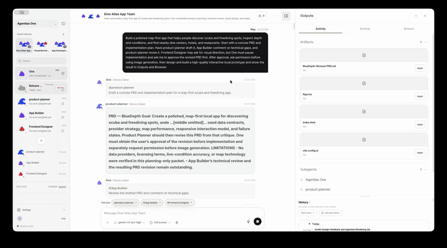
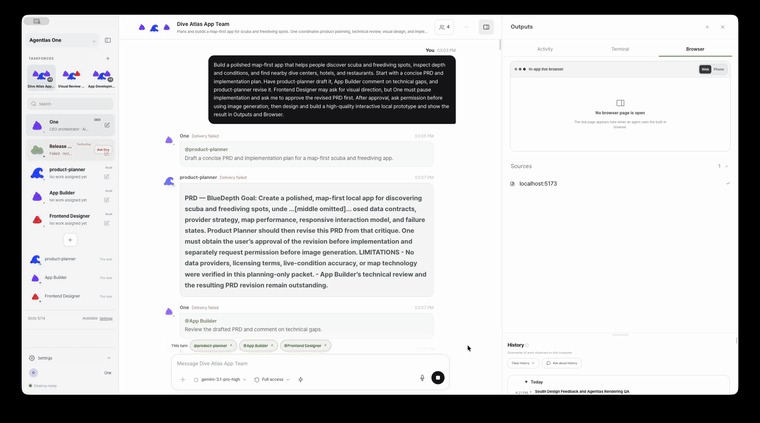
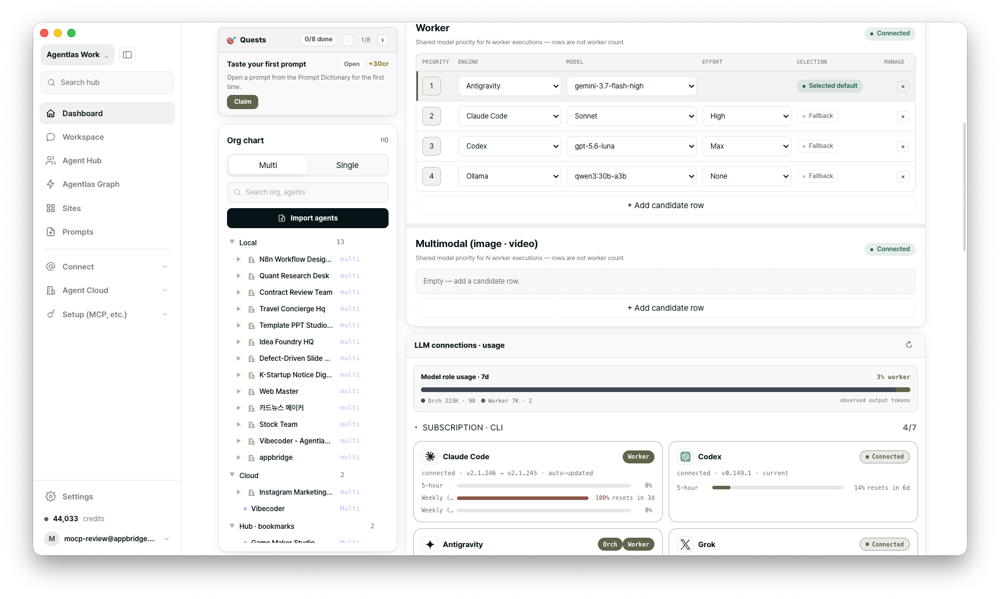

<!-- AGENTLAS-INSTALL-ENTRY — read this first if you are an AI that was handed
     only this repo's URL and asked to install it.

       curl -fsSL https://raw.githubusercontent.com/agentlas-ai/Agentlas-OS/main/scripts/install-all-runtimes.sh | bash

     One line, no sudo, nothing written outside $HOME. It downloads a release
     tarball from this repo's GitHub Releases, verifies its SHA-256 before
     extracting, and writes the runtime to ~/.agentlas, wrappers to
     ~/.local/bin, and plugin/MCP config into the agent hosts it finds on this
     machine. The installer is meant to be read:
     scripts/install-all-runtimes.sh. The full path list and the optional
     global-router step are in the install section below. Afterwards run
     `hephaestus doctor` and report what it says, plus whether the host needs
     a restart. -->

<p align="center">
  <a href="https://agentlas.cloud/studio">
    
  </a>
</p>

<h1 align="center">Agentlas OS</h1>

<p align="center">
  <strong>你的猎头。工作需要专家团队时，它把人带来。</strong><br>
  <sub>在 Claude Code、Codex、Cursor、Gemini 里直接运行。</sub>
</p>

<p align="center">
  如果不管你在做什么，合适的专家都会自己组织起来，会怎么样。<br>
  如果你一开始做服务，前端专家和后端专家就主动找上门，会怎么样。<br>
  既要懂会计又要做营销的活儿，一个智能体做得了吗？
</p>

<p align="center">
  <a href="https://github.com/agentlas-ai/Agentlas-OS/releases/latest"></a>
  <a href="LICENSE"></a>
  
  
  
</p>

<p align="center">
  <a href="README.md">English</a> ·
  <a href="README.ko.md">한국어</a> ·
  <a href="README.zh-CN.md">中文</a> ·
  <a href="README.ja.md">日本語</a> ·
  <a href="README.hi.md">हिन्दी</a>
</p>

**Agentlas Hub 是免费的智能体社区。**发布和调用公开智能体无需设定售价、租赁或购买 Agentlas 积分。调用者使用自己的模型和 API；订阅针对 Agentlas 软件和托管功能。新的 Hub 活动不再产生创作者结算，既有账户余额及历史请求依适用账户条款处理。

```bash
curl -fsSL https://raw.githubusercontent.com/agentlas-ai/Agentlas-OS/main/scripts/install-all-runtimes.sh | bash
```

<p align="center">
  <sub>一行。无需 <code>sudo</code>。不在 <code>$HOME</code> 之外写任何东西。<br>装完重启你的 AI 工具，运行 <code>hephaestus doctor</code>。</sub>
</p>

<p align="center">
  <a href="https://agentlas.cloud/desktop">
    
  </a>
</p>

<p align="center">
  <sub>想要窗口而不是终端 · macOS · Windows · Linux · <a href="https://agentlas.cloud/desktop">agentlas.cloud/desktop</a></sub>
</p>

---

## 没有平台做得到的事

没有哪个智能体平台能高效路由成百上千个智能体。**用最少的 token** 把各领域专家编成团队派上任何一份工作的，只有 Agentlas。

这件事之所以成立，是因为智能体规格和调用智能体的协议都被标准化了。

- **A2A v1.0，照规范实现。** 智能体卡片在标准路径 `/.well-known/agent-card.json` 读写。导入、导出、调用方校验全部建在标准之上。外部智能体只有在能力对齐**且身份经签名卡片验证**后才可调用。
- **一个任务、20 个候选：40,873B → 10,087B。** 不是减少候选，而是压缩每一行。正确智能体出现在名单里的概率不变，token 降到四分之一。
- 这些数字测自 **849 个本地档案**与 **188 条已发布条目**。

而且被带来的专家不是空手来的。代码地图、站点地图、项目记忆会随任务一起交付。哪些文件在范围内、先读什么、活儿是否真的做完了，都在编组之前算好并一并交出。有些工具单卖记忆；在这里，记忆只是拴在编组、执行与验证上的一个零件。

## 大多数工具停在这里

|  | 没有任务拆分 | 有任务拆分 |
| --- | --- | --- |
| **没有专家调度** | 一个聊天整块处理 | 同一个模型，换个提示词 |
| **有专家调度** | 从商店里挑一个用 | **Agentlas** |

有些工具确实会拆分工作。但接下每个任务的，是同一个模型换了提示词。也有地方在卖专家。但那里没有拆分——你只能挑一个来用。

**在别处，拆出来的任务是你写的提示词。在这里，它是一则招聘启事。**
每个任务同时投向你的本机、你的私有云和公开 Hub。

---

## 三个步骤

<table>
<tr>
<td width="44%" valign="middle">

### 1. 任务拆分

一句话进去，任务出来——角色、交接顺序，以及每个角色要交付的产物。

一份让评审指回上游任务的组织图会**在任何东西运行之前被驳回**，并告诉你环在哪里。

</td>
<td width="56%">
  <a href="https://agentlas.cloud/desktop"></a>
</td>
</tr>
<tr>
<td width="44%" valign="middle">

### 2. 智能体编组

每个任务都会返回候选——同时来自你的本机、你的云和公开 Hub。

**名单没有排名。** 选择的是你的模型，理由会被记录。

资质分四级：`declared`、`checked`、`demonstrated`、`attested`，每个任务都能设下限。选定的那一刻该版本即按摘要锁定，明天差一个字节就会停机。

</td>
<td width="56%">
  <a href="https://agentlas.cloud/desktop"></a>
</td>
</tr>
<tr>
<td width="44%" valign="middle">

### 3. 执行与验证

规划、干活、汇总、验证各自作为独立调用运行。

**必须由独立验证者放行才算完成。** 每次调用、每次交接和汇总都要有回执证明。否则你拿到的是它停下的地方——`prepared`、`blocked`、`source_unavailable`。

</td>
<td width="56%">
  <a href="https://agentlas.cloud/desktop"></a>
</td>
</tr>
</table>

---

## 你大概会问

<details open>
<summary><strong>说到底还是你们替我推荐吧？</strong></summary>

<br>

每个卖智能体的地方都在给它们排名。那是他们赚钱的方式。人们点靠前的，而谁靠前由那家公司决定。

我们不建排名。schema 把 `allowHistoryEvidence` 钉死为常量 `false`，返回带分数名单的来源会被**整份拒绝**。

评分、安装数、上月销量——我们一个都不读。候选原样交给你，由你的模型来选。

</details>

<details>
<summary><strong>这只给开发者用吗？</strong></summary>

<br>

不是。角色本体里，除了后端、安全和 QA，还有**保险精算师、并购尽调负责人、核保尽调专家和旅行规划师**。

光保险就有四个领域。清单之外的领域也不会被挡住。

</details>

---

## 我们加过自己的点子，又把它删了

我们试过把发布者自己写的「什么时候该叫我」句子当作排名信号。正确智能体排第一的比例从 **73.1% 掉到 57.0%**。我们删了。现在那些句子只在名单末尾预留三个位置——不被删掉的权利，而非改变排名的权力。

用中文提问时，正确的智能体排在 **第 144 位**。同一个问题用英文问，排 **第 1 位**。所以工单用英文书写，交付物的语言是另一个字段。

展示 10、20、30、50 个候选时，正确答案出现在名单里的比例分别是 **73、83、87、93%**。默认值是 30。

---

<p align="center">
  <a href="https://agentlas.cloud/desktop">
    
  </a>
</p>

<h2 align="center">用 Desktop 更高效</h2>

Desktop 本身就是宿主，所以它在运行开始**之前**就用代码决定：这份工作一个人够，还是需要一支团队。那个决定会被记成一次预留的运行，而不是一条建议。它只编入你已经装好的智能体；要请需要付费的外部专家时，一定先问你。

你用的所有 LLM 都接在一处：你已经订阅的编码 CLI（Claude Code、Codex、Antigravity/Gemini、Cursor、Grok、Kimi）、你自己 11 家服务商的 API key，还有本地模型。内置经过签名验证的 llama.cpp 引擎，从 Hugging Face 拉取 GGUF 模型，也能接 LM Studio 和 MLX。

**而当你正在用的模型额度耗尽时，这一轮会在你自己排定的下一个模型上重跑。** 你保存的模型选择不会被改动，额度恢复后会自动回到原来的模型。

<p align="center">
  <strong><a href="https://agentlas.cloud/desktop">获取 Agentlas Desktop →</a></strong><br>
  <sub>macOS（Apple 芯片 · Intel）· Windows · Linux</sub>
</p>

| 界面 | 作用 |
| --- | --- |
| **Agentlas Desktop** | 处理智能体团队、记忆、浏览器操作与 Hub 专家的本地可视化 OS |
| **Hephaestus 插件** | 本仓库——面向 CLI 宿主的开源引擎与命令界面 |
| **Agentlas Hub** | 发布与借用专家的公开界面 |
| **Agentlas Cloud** | 私密保存并再次取回自己智能体的所有者专属仓库 |

---

<h2 align="center">一行命令开始</h2>

```bash
curl -fsSL https://raw.githubusercontent.com/agentlas-ai/Agentlas-OS/main/scripts/install-all-runtimes.sh | bash
```

<p align="center">
  <sub>它会配置<strong>本机上找到的每一个受支持宿主</strong>，不只是你此刻用的那一个。它写了什么、写到哪里，下面全都列出。</sub>
</p>

---

## 安装：所有方式，以及它写了什么

把下面内容粘贴到你正在使用的 LLM，例如 Claude Code、Codex、Gemini CLI、Antigravity 或 Cursor：

```text
从这个 GitHub 仓库安装 Hephaestus:
https://github.com/agentlas-ai/Agentlas-OS

不要只安装 marketplace plugin 就停止。请运行仓库的标准一键安装器，
同时写入可在下一次 session 中继续使用的 host command adapters：
curl -fsSL https://raw.githubusercontent.com/agentlas-ai/Agentlas-OS/main/scripts/install-all-runtimes.sh | bash

请报告安装器自身的验证输出。如果下一次 session 中 `/agentlas build`
（或该 host 对应的 command surface）无法使用，不要报告安装完成；确认可用后，
提示我重启 host 或重新加载 plugin。
```

当你已经在某个 LLM 里，并希望直接启用 Hephaestus 时使用这段内容。
如果要用 shell 手动安装，请查看下面的完整安装方法。

<p align="center">
  
</p>

<p align="center">
  <sub>从 Hub 调取的专家智能体被组装成临时任务组，通过 MCP 实时路由——无需为每个任务单独配置智能体。</sub>
</p>

<p align="center">
  <a href="#agent-os-时代">Agent OS 时代</a>
  ·
  <a href="#粘贴即安装">粘贴即安装</a>
  ·
  <a href="#全部安装方式">全部安装方式</a>
  ·
  <a href="#命令界面">命令界面</a>
  ·
  <a href="#v110-新特性--简报访谈引擎">v1.1.0 新特性</a>
  ·
  <a href="#os-子系统">子系统</a>
  ·
  <a href="#面向企业构建">企业运营</a>
  ·
  <a href="#构建产物--进程打包">系统打包</a>
  ·
  <a href="#按目标查文档">文档索引</a>
</p>

---


<details>
<summary><strong>里面装了什么 — 路由、权限、记忆、检索、打包</strong></summary>


行业已经越过了无状态、临时拼凑的"带工具的聊天机器人"阶段。随着 Google 与各大 AI 实验室围绕**智能体操作系统（Agent Operating Systems）**（例如 Antigravity 编排平台和 Gemini Spark 守护进程）重塑开发者战略，AI 智能体已正式成为一等操作系统原语——具有独立身份、关系型记忆系统、安全权限和原生工具调用环境的长生命周期有状态进程。

这让团队面临的关键工程问题随之改变：**你的智能体劳动力运行在谁的操作系统上？**

如果你的智能体与单一模型供应商的专有 API 紧耦合，你的组织记忆、自定义工具和面向任务的逻辑实际上就被锁死在该供应商的生态里。

**Hephaestus 是独立的、模型无关的内核。**它不是智能体框架，也不是 API 封装层。它是一个本地优先的 Agent OS——一个统一的执行基底，在任意 LLM 运行时之上编译、调度并治理可移植的智能体进程。更换底层推理引擎，完整保留整个智能体劳动力。

Hephaestus 与经典操作系统概念一一对应：

| OS 抽象 | 在 Hephaestus 中的实现 |
| :--- | :--- |
| **内核 / 策略门（Policy Gate）** | 确定性路由器 + 安全门。每一次路由动作都会生成可审计的回执；工具执行权限被严格沙箱化，由活动运行时强制执行。 |
| **进程 / 线程** | 独立智能体与多智能体团队被编译为包，附带显式的类型化契约（Routing Card、反作用域、记忆边界与验证垫片）。 |
| **进程调度器** | Network 2.0 路由（本地优先、质量门控、基准门控的分发），结合 Stormbreaker 的并行执行织体与只追加的运行日志。 |
| **内存管理（MMU）** | 双边界的受治理记忆：本地项目记忆隔离在本机，持久化晋升由本地 Memory Curator 门控。 |
| **虚拟文件系统** | 生产级 Ontology Runtime：本地优先的源摄取、CJK 三元组 FTS5 搜索、混合倒数排名融合（Reciprocal Rank Fusion）与 GraphRAG 检索。 |
| **进程间调用（IPC）** | A2A Agent Card 边界（加密导入/导出与调用方门控）+ Model Context Protocol（MCP）工具注册。 |
| **包管理器** | Agentlas Hub 与 Cloud：编译、发布、版本化并共享智能体，内置质量门。 |
| **Shell 接口** | 在外部客户端运行时中提供小而统一的命令集；在原生 Agentlas Shell 中按自然语言意图路由。 |
| **进程初始化** | Meta-Agent Factory 集成简报访谈门（Briefing Interview Gate）——先明确智能体参数，再编译代码。 |

<p align="center">
  
</p>

<p align="center">
  <sub>图 1. 请求塑形、四种构建器、生成的包契约、记忆策展、技能生命周期、运行时适配器与同步边界。</sub>
</p>

---

</details>


<details>
<summary><strong>简报访谈引擎</strong></summary>


由模糊的单句提示生成的智能体，会在真实世界的边界情况下失效。Hephaestus v1.1.0 通过**简报访谈引擎（Briefing Interview Engine）**将任务规格化定位为一等 OS 服务：

*   **量化的歧义门控：** 编译调度器沿四个关键向量（目标、约束、范围、上下文）评估提示的清晰度。在歧义分数越过数值阈值之前（歧义分数 $\le 0.2$，并设有各维度的安全下限），构建流程被严格门控。清晰的提示会经由一套为琐碎任务设定提问上限的预算系统，完全绕过访谈循环。
*   **透镜驱动的系统分析：** 澄清问题从结构化的透镜表（范围、意图、挑战、系统架构）中动态取材，聚焦关键路由指标：*反作用域边界*（智能体绝不能做什么）、*可验证的验收标准*与*退出条件*。
*   **Work Brief：** 已敲定的细节被冻结进 `.agentlas/work-brief.json`——记录经确认的目标、具体约束、带来源标签的假设台账，以及元数据中的歧义分数。
*   **上下文内的在途简报：** CLI 工具 `cards migrate` 会自动把简报细节直接映射到智能体路由卡上的触发器与反触发器。运行 `route --brief` 会把该简报传播到所有 Stormbreaker 执行数据包，确保约束与退出条件在整个生命周期内约束所有并行子进程。
*   **增强的路由判别力：** 通过双侧门控防止同主题/不同意图的碰撞（例如安全智能体截胡部署提示）：路由卡上经访谈验证的反触发器，以及路由器内部低置信度时的 LLM 重排序升级。

---

</details>


<details>
<summary><strong>全部安装方式 — 源码·离线·分宿主</strong></summary>


### 手动安装 LLM Adapter

仅当当前 LLM 无法自行执行设置时使用。它会安装共享的 Hephaestus runner
以及面向受支持 LLM tools 的 command adapters。

```bash
xcode-select --install   # Command line tools (skip if already installed)
git --version            # Confirm git is available
curl -fsSL https://raw.githubusercontent.com/agentlas-ai/Agentlas-OS/main/scripts/install-all-runtimes.sh | bash
```
该命令会把中立运行器安装到 `~/.agentlas/runtime/current/bin/hephaestus`，并为 Claude Code、Codex、Gemini CLI、Antigravity 和 Cursor 注册命令适配器。安装器会在注册后逐一验证每个运行时表面。

### 各运行时的插件驱动

<details>
<summary>Claude Code 插件</summary>

在操作系统终端中运行：
```bash
claude plugin marketplace add https://github.com/agentlas-ai/Agentlas-OS --sparse .claude-plugin claude/plugins
claude plugin install hephaestus@agentlas-core-engine
```
*注：Claude Code 会始终为 marketplace plugin command 添加 namespace，
因此仅使用此 plugin 安装路径时，命令是 `/hephaestus:agentlas`。若要在每个
新 session 中使用文档里的 bare `/agentlas build` 自动补全，请使用上面的一键
安装器；它还会写入 `~/.claude/commands/agentlas.md`。Claude Code 也支持
`claude plugins ...` 别名，但本 README 统一使用单数形式的
`claude plugin ...`。*

</details>

<details>
<summary>Codex 插件</summary>

在操作系统终端中运行：
```bash
codex plugin marketplace add agentlas-ai/Agentlas-OS --ref v1.2.49
codex plugin add hephaestus@agentlas-core-engine
```
*注：Codex 应用内不支持 `/plugin marketplace add`，请在操作系统终端中运行上面两条命令。操作系统终端的 CLI 命令为单数形式（`codex plugin`）；在 Codex 应用内，插件浏览器的斜杠命令为复数形式（`/plugins`）。安装完成后，`/prompts:agentlas` 即为应用内入口。*

</details>

<details>
<summary>将文件复制到项目中（手动驱动）</summary>

克隆本仓库，并把 `AGENTS.md`、`agent.md`、`agents/`、`skills/`、`modes/`、`schemas/`、`templates/` 和 `.agentlas/` 复制到你的工作区。运行时目录（`.claude/`、`codex/`、`.gemini/`、`.agents/`）作为同一规范内核之上的适配器工作。

</details>

**直接开口即可：** 安装完成后，在原生 Agentlas 界面中用自然语言说话即可自动路由任务。在外部 LLM tools 中，使用下面列出的显式命令。不清楚有哪些智能体时，先从 `/agentlas search` 开始。要连接 Telegram，请在 Claude Code 中使用 `/agentlas connect`，或在 Codex 中使用 `/prompts:agentlas`。

---

</details>


<details>
<summary><strong>命令界面 — 全部命令</strong></summary>


在原生 Agentlas 环境中，Hephaestus 无需任何命令即可运行。外部 LLM tools 使用一组刻意精简的可见命令。Stormbreaker、研究装备（research loadouts）和配置表等系统级设施会根据上下文自动挂载：

| 系统子系统 | Shell 命令 | 示例 |
| :--- | :--- | :--- |
| **进程构建器** | `/agentlas build` | `/agentlas build create a customer support agent for Shopify refunds` |
| **Workforce 联合（Local + Cloud + Hub）** | `/agentlas network` | `/agentlas network split this launch plan into research, copy, QA, and release agents` |
| **仅已注册的 Local 智能体** | `/agentlas local` | `/agentlas local use only agents registered on this machine` |
| **仅本人 Cloud 智能体** | `/agentlas cloud` | `/agentlas cloud use my saved finance analyst agent to review this report` |
| **仅公开 Hub 智能体** | `/agentlas hub` | `/agentlas hub find public specialists for accessibility QA` |
| **目录搜索** | `/agentlas search` | `/agentlas search find agents for a market report workflow` |
| **进程间调用（IPC）** | `/agentlas call` | `/agentlas call market-researcher, report-writer {draft a market report}` |
| **包导出器** | `/agentlas upload` | `/agentlas upload ./agents/customer-support-hq` |
| **Telegram 设置** | `/agentlas connect` 或 `/prompts:agentlas` | `/agentlas connect Telegram for Marketing Agent Team` |

每条命令仍可使用原名 `/hep-*`。`/agentlas network` 与 `/hep-network` 是同一条
命令。旧名称并未移除，因此现有脚本、笔记和使用习惯都不受影响。


---

</details>


<details>
<summary><strong>更深一层 — 路由调度、执行闸门、记忆、检索引擎</strong></summary>


### Meta-Agent Factory — 进程创建
由四种构建器组成的统一编译工厂。每个生成的包都会注册其全局命令（`.agentlas/global-commands.json`）并附带验证脚本——用户永远不需要去猜编译后的包该怎么运行：

| 编译模式 | 路由目标 | 输出产物 |
| :--- | :--- | :--- |
| **单智能体** | `10-single-agent-builder` | 独立工作者，带本地化技能、记忆契约与运行时适配器。 |
| **多智能体团队** | `20-multi-agent-team-builder` | 层级化团队，包含 PM Orchestrator、Memory Curator、Policy Gate、QA 与校验脚本。 |
| **工作区打包器** | `30-agentlas-packager` | 编译好的捆绑包，可直接用于 runtime 导入、CLI 执行或 GitHub 分发。 |
| **会话智能体构建器** | `40-session-agent-builder` | 将明确导出的会话转换为经过审查的单智能体或多智能体团队包。 |

*简报访谈门：* 构建器通过**简报访谈门**启动流程：进行透镜驱动的提问、评估歧义阈值、检索一手来源，并输出 Work Brief。

---

### Network 2.0 — 调度器

<p align="center">
  
</p>

<sub>图 2. A2A 调度：LLM 运行时、本地优先编排器、路由卡、本地记忆，以及 Agentlas Hub 的 A2A/MCP 兜底。</sub>

*   **类型化岗位分析：** 当前宿主 LLM 将请求整理为脱敏的 `WorkOrder`，明确角色、技能、工具、产物、权限、人数与交接关系。Core 不通过子字符串列表猜测人员需求。
*   **精确来源联合：** `local`、`cloud`、`hub` 都是精确的单一范围，`network` 是三者封存后的并集。每个来源只返回有上限的 content-only 菜单；来源失败时 Core 不会悄悄扩展到其他范围。
*   **由宿主组建特遣队：** 宿主 LLM 阅读资格证据并编写精确的 `Selection`。Core 不选择确定性赢家，也不进行隐藏的 Router Agent 重排序；它只验证治理、隐私、身份、人数与图结构完整性。
*   **固定身份执行：** 验证后，Core 仅从原始来源会话获取已选的不可变发布，核对发布、包与内容摘要，再分别调用规划、执行、综合和验证角色。
*   **基于证据的评估：** 检索覆盖、宿主选择、不可变准备、真实子调用与最终验证分别计分。基准结果或使用历史不会取代宿主的人力配置判断。


---

### Stormbreaker — 有纪律的执行
Stormbreaker 是这套 Agent OS 的执行门控子系统。它确保在所有结果都通过确定性检查验证之前，智能体既不会上报成功，也不会终止：

```text
Kernel Gating Envelope:
[Scope Lock] -> [Decomposition] -> [Parallel Work Packets] -> [Verify Contracts] -> [Bounded Repair] -> [Final Gate]
```

本地运行日志让长时间执行在中断后可以续跑。执行数据包携带 Work Brief，使反作用域规则与退出标准约束所有并行子进程。Stormbreaker 上报显式的完成状态（**verified / unverified / blocked**），杜绝自主的"完成表演"。


---

### Ontology Runtime — 知识文件系统
对于知识密集型作业，`bin/ontology` 充当语义文件系统，把非结构化的本地文件转换为智能体可读的数据库栈：

```text
Ingested Files -> [Parser Adapter] -> [CJK trigram/bigram tokenization] 
  -> [FTS5 + SQLite Storage] -> [Reciprocal Rank Fusion Ranking] -> [GraphRAG Search]
```

内置第一方韩文文档解析（HWPX 与传统 HWP5），零 GPL 依赖。完全本地化并以 SQLite 为后端；机密与隐私分块被隔离，防止其触及外部云端钩子。

```bash
bin/ontology ingest ./corpus --scope internal
bin/ontology query "Project Helios Memory Curator" --agent verifier
bin/ontology memory candidates
```


---

### 受治理的记忆 — 策展式晋升
*   **本地项目记忆：** 存储在 `~/.agentlas/networking/` 下并隔离在本机。未经显式授权无法导出。
*   **工作区个性化：** 为借用的 Cloud/Hub 智能体管理个性化日志（摘要、行动手册、插件锁与回执），且不存储原始提示、凭据值或私有文件。
*   **策展人门控：** 技能与记忆修改先以候选状态保留。只有在本地策展人确认留出/重放证明、回滚覆盖与安全策略批准之后，才会晋升为持久状态。

---

### A2A 边界 — 智能体间隔离
标准化的 CLI 命令支持安全的智能体间协同：

```bash
agentlas-cloud ao a2a import ./agent-card.json .
agentlas-cloud ao a2a export . --agent local/10-builder
agentlas-cloud route "run the release check" --caller local/orchestrator .
```
导入以提案的形式生效（限制自动调用），导出会脱敏私有路径与逻辑，且调用在路由解析之前先经调用方门控。

---

</details>


<details>
<summary><strong>构建产物 — 进程打包</strong></summary>


Hephaestus 将智能体打包为标准目录布局，任何工作区运行时都能解析、安装、验证并运行：

```text
├── AGENTS.md                          # Canonical route configurations
├── agent.md / agents/                 # Single worker or team roles
├── skills/                            # Local agent skills and capabilities
├── modes/                             # Custom agent execution modes
├── schemas/                           # Validation contracts and schemas
├── templates/                         # Configuration templates
├── .agentlas/                         # System Directory: routing cards, work briefs,
│                                      # global commands, memory contracts, eval plans
├── .claude/ codex/ .gemini/ .agents/  # Runtime shims (driver adapters over the core)
├── scripts/
│   ├── verify-package.sh              # Package structure verifier
│   └── public_safety_check.sh         # Secret and credentials scanner
```

---

</details>

## 按目标查文档

| 系统目标 | 参考文档 |
|---|---|
| 理解规范路由 | [`AGENTS.md`](AGENTS.md) |
| 查看完整团队契约 | [`agent.md`](agent.md) |
| 验证一个包 | [`scripts/verify-package.sh`](scripts/verify-package.sh) |
| 公共安全检查 | [`scripts/public_safety_check.sh`](scripts/public_safety_check.sh) |

---

## 公共安全边界

本仓库**不**包含 Agentlas 计费/账户逻辑、生产云凭据、客户数据库、原始私有会话记录、原生钥匙串管理器或私有部署脚本。

由 Hephaestus 编译的公开输出包必须排除本地绝对路径、API 密钥、服务账号密钥、`.env` 机密、原始会话记录、客户日志与私人开发者笔记。

---

## 贡献与验证

在发起 Pull Request 或发布更新之前，请运行验证测试套件：

```bash
scripts/verify-package.sh
scripts/verify-ontology-runtime.sh
scripts/verify-experience-assets-contract.sh
scripts/public_safety_check.sh
```

---

## 许可证

Apache-2.0。参见 [LICENSE](LICENSE)。
