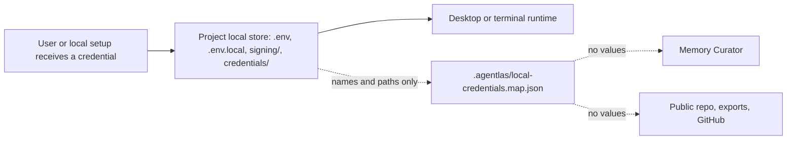

# Local Credential Store

Agentlas packages may need real credentials to keep release, billing, cloud, or
store workflows from stopping. The rule is not "never save credentials"; the
rule is "save values only in the local project store, never in public package
files or durable memory."

## Shape



## Files

Each activated local project should reserve these files and folders:

```text
<project>/
├── .env
├── .env.local
├── .env.example
├── signing/
│   └── README.md
├── credentials/
│   └── README.md
└── .agentlas/
    └── local-credentials.map.json
```

`.env`, `.env.local`, `signing/*`, and `credentials/*` are local-only and must be
ignored by git. `README.md` guide files and `.env.example` may be committed
because they contain placeholders only.

## What Goes Where

| Need | Local value home | Memory-visible record |
|---|---|---|
| API token or scalar key | `.env` or `.env.local` | env name, provider, owner, stale-check |
| Store release JSON file | `signing/` | relative file path and validation command |
| Firebase or app config file | `credentials/` | relative file path and target app |
| Apple signing material | `signing/` | relative file path and signing owner |
| Shared reusable key | local keychain or global local env file | project-scoped env name |

## Map Contract

`.agentlas/local-credentials.map.json` is an index, not a secret vault. It may say
that a local value exists, but it must not include the value itself.

Example:

```json
{
  "schemaVersion": "1.0",
  "kind": "agentlas-local-credential-store",
  "projectName": "memz",
  "projectRoot": ".",
  "envFiles": [".env", ".env.local"],
  "secretDirs": ["signing", "credentials"],
  "entries": [
    {
      "id": "google-play-production",
      "provider": "google_play",
      "env": ["SUPPLY_JSON_KEY"],
      "localFiles": ["signing/google-play.json"],
      "owner": "project",
      "valueMaterialized": true,
      "requiredFor": ["android_release"],
      "lastVerified": null,
      "staleCheck": "Validate store API access before upload."
    }
  ]
}
```

## Runtime Rules

- Local runtimes may write real values into `.env`, `.env.local`, keychain, or
  ignored project folders.
- Memory Curator and PM Soul may remember provider names, env names, owner,
  project, local relative paths, and verification commands.
- Memory Curator and PM Soul must not copy scalar values, key material, tokens,
  cookies, or credential file contents into `.agentlas` memory, public docs,
  shared team memory, issue comments, or GitHub.
- When an agent needs a credential, it should first read the project-local map,
  then the project `.env` files, then project-scoped global local env, then the
  keychain or vault.
- For public packages, include only `.env.example`, README guide files, schemas,
  and templates.
