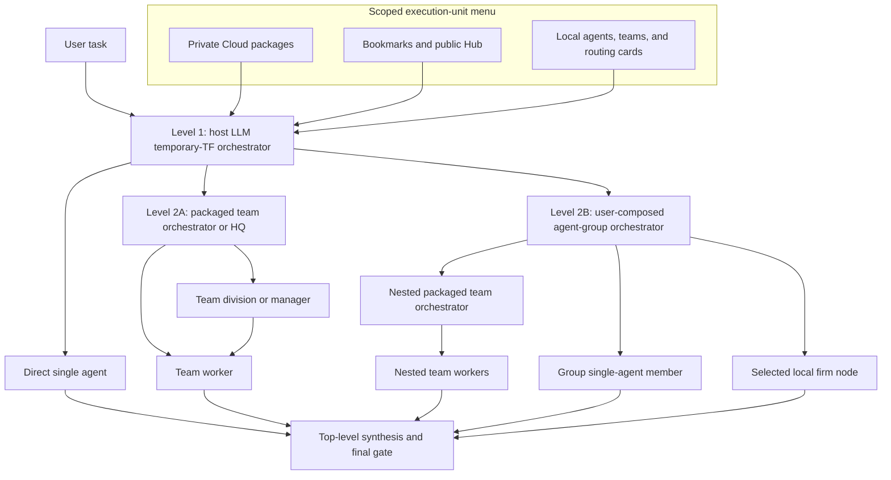
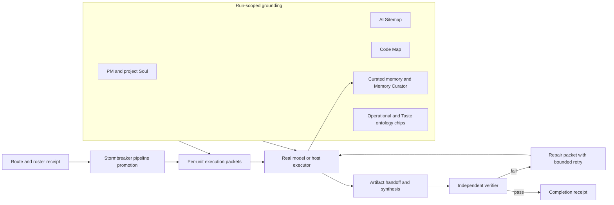

# Agentlas Three-Level Orchestration Runtime

Status: canonical target plus current-runtime audit, 2026-07-15.

This document fixes one boundary that must not be blurred in tests or product
claims: Agentlas Cloud, Hub, bookmarks, and local routing cards provide a menu
of BYOM execution units.  The host LLM is the top-level temporary task-force
orchestrator.  A routing receipt or a prepared Hub bundle is not proof that a
worker model ran.

## Canonical hierarchy

The hierarchy is semantic and executable:

1. The Level 1 LLM receives the scoped menu, chooses Cloud, Hub, bookmark, or
   local execution units, records their source and entity kind, decomposes the
   task, and owns final synthesis.
2. A packaged multi-agent team retains the orchestrator and worker topology it
   shipped with.  Its team orchestrator is a middle manager inside the
   temporary TF.
3. A user-created agent group receives a generated group orchestrator at run
   time.  The group may contain single agents, firm nodes, or packaged teams.
   A packaged team member must expand into its own manager and workers; it must
   not be flattened into one specialist prompt.
4. A single agent has no artificial middle layer.  It receives one bounded
   packet directly from the Level 1 orchestrator.

## Execution and grounding loop

Every executable node must receive only its allowed, run-scoped grounding.  A
test passes only when the run evidence shows which Soul, Sitemap, Code Map,
memory items, and ontology-chip release were selected for that node.

## Proof levels

| Evidence | What it proves | What it does not prove |
| --- | --- | --- |
| Network route `receipt_id` | Discovery and routing decision was recorded | Any model or worker executed |
| Hub call `status=prepared` | A BYOM runtime bundle was returned | The bundle's agent or team ran |
| Stormbreaker packet file | The task was materialized into an execution contract | An executor consumed it |
| Executor exit code `0` | The configured process returned successfully | The requested artifact is correct |
| Planner, worker, and synthesis invocation receipts | Distinct model turns ran | The result satisfies the task |
| Independent verifier pass | The observable acceptance contract passed | Uninstrumented memory or hierarchy claims |
| Completion receipt with all required evidence | Route, execution, grounding, and verification are joined | Nothing outside the receipt's declared scope |

## Current implementation audit

| Surface | Directly observed behavior | Status against this contract |
| --- | --- | --- |
| Core Network router | Searches Cloud, bookmarks, Hub, or local cards and writes receipts. Confident selection is lexical/semantic scoring; only low-confidence cases attach a host-LLM router directive. | Menu provider exists; it is not itself the Level 1 LLM. |
| `hep-network` and Desktop Core wrapper | Desktop parses the explicit command once, preserves exact Cloud/Hub entity targets, and dispatches the selected units through its top-level task-force executor. | Explicit route-to-execution bridge is wired; Core-only CLI still needs an executor command for real model turns. |
| `hep-storm` query path | Promotes a Hub temporary TF to plan/build/verify packets. | Pipeline creation works. |
| Core packet execution | Defaults to `materialize` unless an external `--executor-command` is supplied. The shipped runtime has no stock Codex/Ollama packet executor. | Real worker execution is not wired by default. |
| Agentlas Field treatment | Fetches route/bundle data, concatenates one overlay, and calls one Terminus-2 chat. | Not a multi-agent runtime benchmark. |
| Desktop packaged firm | CEO plans, divisions can plan again, specialists run in parallel, and managers synthesize. Firm nodes receive scoped memory and ontology context. | Real nested local execution exists. |
| Desktop user-created group | Generates a group planner, executes one turn per member, and synthesizes one group result. A top-level TF invokes the Group as a nested middle manager rather than flattening its members. | Real nested group orchestration exists with depth/cycle guards. |
| Packaged team inside a Desktop group | The current unreleased Desktop working tree can run an explicit manager/worker graph as manager planning, separate worker turns, and manager synthesis. `npm run test:borrowed-task-force` passed 79 fixture checks. | Host-side nesting is executable when an authoritative graph exists; fixture success does not prove the live Hub package supplies one. |
| Live Hub team bundle | On 2026-07-15, Hub search labeled `product-development-hq` as a team, but its runtime bundle returned an empty entity kind and no execution graph. Explicit `hub/team/product-development-hq` failed with `entity_kind_mismatch`, `actual_entity_kind=unproven`. | The current live package cannot be proved or run as a nested team. Treating its root `AGENTS.md` as a single agent would flatten it. |
| Desktop task-force memory | Firm nodes call `buildMemoryContext`, which can inject Project Soul, Sitemap, Code Map, and curated memory. Borrowed/group workers do not call it. | RAG grounding is not uniform across execution-unit kinds. |
| Desktop ontology chips | Installed firm/group workers can receive run-scoped Operational/Taste context; Hub-only borrowed workers have no installed-agent binding. | Chip activation is partial and cannot yet be proved for all TF nodes. |
| Memory Curator | Deterministic post-turn curation records count-only run receipts and persists allowed memory events. | Always-on substrate exists; end-to-end TF attribution still needs benchmark proof. |

## Required hard-test suite

Security-attack tasks are excluded from the model comparison because provider
safety filters would confound architecture and model capability.

1. **Safe model control:** run the same non-security Terminal-Bench task with
   Terra and Qwen under the identical terminal harness, first without Agentlas
   and then with the tested Agentlas runtime.
2. **Mixed roster:** one task must require a local single agent, a Hub or Cloud
   packaged team, and a user-created group.  The Level 1 receipt must preserve
   source, entity kind, packet, model, and invocation identity.
3. **Nested team:** the selected packaged team must produce a manager receipt,
   at least two child-worker receipts, and one team synthesis receipt before its
   result returns to Level 1.
4. **Group runtime:** the generated group orchestrator must produce a plan,
   distinct member invocations, and a synthesis.  A team member must remain
   nested rather than appear as a single specialist call.
5. **Stormbreaker:** each packet must move through materialized, executing, and
   passing or failed states.  Process exit alone cannot mark a packet passing;
   the task verifier must decide.
6. **RAG memory:** seed unique, non-secret facts separately in Project Soul,
   Sitemap, Code Map, and curated memory.  A task that needs all four must cite
   their source identifiers in the run evidence without leaking unrelated
   content.
7. **Memory Curator:** emit one allowed durable memory event, one duplicate, and
   one secret-like event.  Verify written, deduped, and redacted counts and the
   correct owner/scope.
8. **Ontology chips:** attach task-relevant and irrelevant Operational/Taste
   releases.  Verify only relevant releases activate, record their release IDs,
   and keep the combined dynamic context within the runtime token ceiling.
9. **Final gate:** the official task verifier and the hierarchy/grounding audit
   must both pass.  A high task score with missing worker, memory, or chip
   receipts is an architecture failure.

## Current measured result

The safe `terminal-bench/fix-git` 2x2 control produced:

| Model | Baseline Terminus-2 | Current Field Hub overlay |
| --- | ---: | ---: |
| `gpt-5.6-terra` | 1.0 | 1.0 |
| `qwen3:30b-a3b` Q4_K_M | 0.0 | 0.0 |

Both Field-overlay runs selected the same `web-master` bundle for plan, build,
and verify. The task was Git recovery, so this is a directly observed routing
quality defect. Field still made one model call; the table is a model/control
result, not proof of the three-level architecture.

The Core vertical slice separately proved distinct plan/build execution,
artifact dependency gating, verifier-triggered repair, a bounded runner retry,
and a blocked final gate for the failing Qwen build. It cannot prove the
packaged-team middle layer while the live Hub bundle omits its execution graph.

## Source anchors

- Core routing and receipts: `agentlas_cloud/networking/router.py`
- Hub TF promotion and packet execution: `agentlas_cloud/networking/stormbreaker_runner.py`
- Model/session packet allocation: `agentlas_cloud/networking/execution_fabric.py`
- Desktop agent groups: `../agentlas_desktop/electron/store/agent-groups.ts`
- Desktop group and borrowed-TF execution: `../agentlas_desktop/electron/mcp/borrowed-task-force.ts`
- Desktop packaged-firm hierarchy: `../agentlas_desktop/electron/mcp/firm-orchestrator.ts`
- Project Soul, Sitemap, Code Map, and hybrid recall: `../agentlas_desktop/electron/memory/context.ts`
- Memory Curator: `../agentlas_desktop/electron/memory/curator.ts`
- Operational/Taste runtime context: `../agentlas_desktop/electron/ontology/runtime-context.ts`
